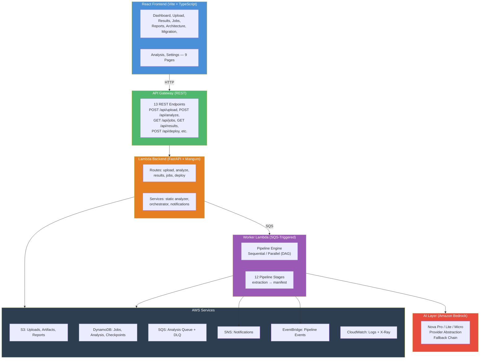

# EMIP — Enterprise Modernization Intelligence Platform

## Version 1.0.0 (Validation Phase)

---

## What EMIP Is

EMIP is a platform that analyzes legacy Java (Spring Boot) applications and produces AI-driven recommendations for migrating to AWS microservices. It combines static code analysis with Amazon Bedrock-powered AI to eliminate guesswork in monolith-to-microservices migration.

### Goals

| Goal | Description |
|------|-------------|
| **Analyze** | Deep static analysis of Java codebases (regex-based, with plugin-based enterprise analysis) |
| **Recommend** | AI-generated service boundaries and ADRs, plus deterministic migration waves and cost estimates |
| **Estimate** | Cost comparison and ROI analysis (current vs post-migration) |
| **Automate** | Generate deployable Spring Boot microservice scaffolding (agentic codegen, Phase 3) |
| **Govern** | Architecture Decision Records with full explainability and confidence breakdown |

### What the Platform Produces

| Output | Description |
|--------|-------------|
| Architecture Analysis | Code metrics, dependency graphs, package trees, god class/circular dep detection |
| Service Boundaries | AI-suggested microservice decomposition with confidence scoring |
| Cloud Readiness | 6-dimension readiness scoring with evidence (code quality, architecture, cloud readiness, service separation, database coupling, documentation) |
| Architecture Decision Records | Context, tradeoffs, consequences for each recommended decision |
| Migration Plans | Wave-based migration roadmap with dependency ordering, risk, and timeline |
| Cost Estimation | Current vs post-migration cost comparison, annual savings, payback period |
| Explainability | Confidence breakdown, risk heatmap, business capability mapping, reasoning |
| Executive Reports | Structured summaries suitable for stakeholder review |
| Deployment Manifests | Artifact inventory, pipeline metadata, token usage, cost tracking |

### Architecture (High-Level)



### Data Flow

```
1. Upload    → POST /api/upload ZIP → S3 jobs/{id}/raw/ → DynamoDB job record
2. Trigger   → POST /api/analyze/{id} → SQS enqueue → returns 202 Accepted
3. Worker    → SQS triggers Worker Lambda → PipelineEngine → 12 stages
4. AI        → `ai_boundaries` + `ai_adrs` invoke Amazon Bedrock (Nova Pro/Lite/Micro); `ai_readiness`, `ai_migration`, `ai_cost`, `ai_explainability` are deterministic-by-design (`sprint3-deterministic`)
5. Storage   → Each stage → ArtifactRepository → S3 + DynamoDB metadata
6. Polling   → Frontend polls GET /api/results/{id} → real-time progress
7. Complete  → EventBridge → SNS terminal notification (email when configured); frontend picks up finished results by polling
```

### Completed Features

| Feature | Status |
|---------|--------|
| 12 pipeline stages (extraction → manifest) | ✅ Complete |
| Amazon Bedrock AI layer (Nova Pro/Lite/Micro) | ✅ Complete |
| Provider abstraction with fallback chain | ✅ Complete |
| 4 analysis modes (FAST, NORMAL, DEEP, BENCHMARK) | ✅ Complete |
| DAG-based parallel execution | ✅ Complete |
| Checkpoint/resume (pause/resume/cancel) | ✅ Complete |
| Plugin-based analysis engine (10 analyzers) | ✅ Complete |
| Static Java analyzer (regex-based) | ✅ Complete |
| Artifact system with versioning and compression | ✅ Complete |
| S3 SSE encryption, X-Ray tracing | ✅ Complete |
| 249+ passing tests | ✅ Complete |
| SAM deployment (canonical; CDK stack experimental/legacy) | ✅ Complete |
| Frontend with 9 pages | ✅ Feature-complete |
| REST API with 13 endpoints | ✅ Complete |

### Future Vision

| Sprint | Feature |
|--------|---------|
| Sprint 6 | Advanced static analysis (JavaParser AST, call graph, control flow, data flow) |
| Sprint 7 | Enterprise knowledge base (RAG, OpenSearch, vector search, Well-Architected Framework) |
| Sprint 8 | Modernization studio (interactive canvas, drag-and-drop service boundaries, migration simulation) |
| Sprint 9 | Deployment automation (CloudFormation, Terraform, CDK, K8s, Docker Compose, CI/CD generation) |
| Sprint 10 | Executive intelligence (portfolio dashboard, multi-project analytics, cross-project risk scoring, ROI) |

### Technology Stack

| Layer | Technology | Version |
|-------|-----------|---------|
| **Backend Runtime** | Python + FastAPI + Mangum | 3.14 / 0.115+ |
| **AI** | Amazon Bedrock (Nova Pro, Nova Lite, Nova Micro) | — |
| **Async Worker** | SQS-triggered Lambda | — |
| **Frontend** | React + TypeScript | 18.x / 5.x |
| **Build Tool** | Vite | 5.x |
| **CSS** | Tailwind CSS | v3 |
| **State** | Zustand + TanStack React Query | — |
| **Charts** | Recharts + ReactFlow | — |
| **UI** | Framer Motion, sonner, lucide-react, cmdk | — |
| **Infrastructure** | AWS SAM (canonical); CDK stack experimental/legacy | — |
| **Database** | DynamoDB (jobs, analysis, checkpoints) | — |
| **Storage** | S3 (uploads, artifacts, reports) | — |
| **Messaging** | SQS, SNS, EventBridge | — |
| **Observability** | CloudWatch Logs + X-Ray | — |
| **Logging** | structlog | — |
| **Validation** | Pydantic v2 | — |

### Directory Structure

```
ProjectOne/
├── backend/
│   ├── handler.py               # Lambda entry point (Mangum)
│   ├── worker_handler.py        # SQS worker entry point
│   ├── app/
│   │   ├── ai/                  # Sprint 3 AI layer (provider, engine, orchestrator, pipeline, etc.)
│   │   ├── analysis/            # Sprint 2 plugin-based analysis (10 analyzers)
│   │   ├── artifacts/           # Artifact repository, models, versioning
│   │   ├── aws/                 # AWS client factory (boto3 wrappers)
│   │   ├── core/                # Settings, analysis profiles, security, constants
│   │   ├── exceptions/          # EMIP exception hierarchy
│   │   ├── models/              # Pydantic schemas (analysis, job, report, etc.)
│   │   ├── pipeline/            # Engine, stage base, 12 stage implementations
│   │   ├── prompts/             # Versioned prompt templates
│   │   ├── reports/             # Report builders
│   │   ├── routes/              # FastAPI route handlers (5 route files)
│   │   ├── scheduling/          # DAG, executor (seq + parallel), worker pool
│   │   ├── services/            # Static analyzer, orchestrator, events, workers
│   │   └── validators/          # Input validation (ZIP, etc.)
│   ├── tests/                   # Test suite (249+ tests)
│   ├── requirements.txt
│   └── Dockerfile
├── frontend/
│   ├── src/
│   │   ├── pages/               # 9 page components
│   │   ├── components/          # Reusable UI components
│   │   ├── hooks/               # Custom React hooks
│   │   ├── services/            # API client (Axios), jobService
│   │   ├── store/               # Zustand state management
│   │   ├── types/               # TypeScript type definitions
│   │   └── utils/               # Formatters, constants
│   └── ...
├── infrastructure/
│   ├── template.yaml            # SAM template (canonical)
│   ├── cdk_stacks/              # CDK stack (experimental/legacy — do not deploy)
│   ├── parameters/              # Environment parameter files
│   └── policies/                # IAM policy documents
├── layers/
│   └── dependencies/            # Lambda layer (FastAPI, Mangum, structlog, pydantic)
├── scripts/
│   └── fresh_start.py           # Data reset utility
├── PROJECT_STATUS.md            # Full project status and sprint history
├── SETUP.md                     # Handover guide and setup instructions
└── docs/                        # Documentation directory
```
