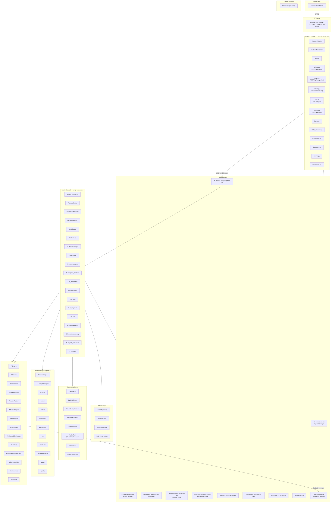
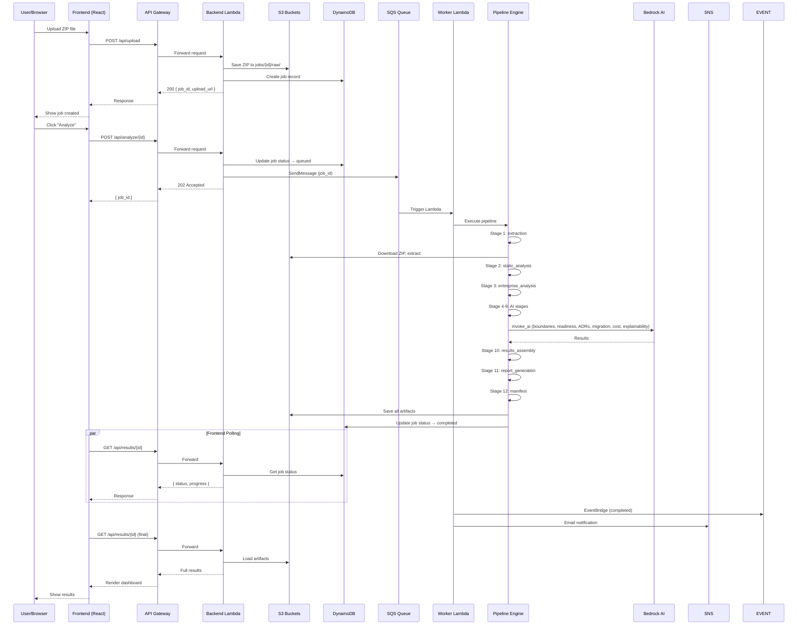

# Architecture

## Enterprise Modernization Intelligence Platform v1.0.0

---

## High-Level System Architecture



---

## Data Flow



---

## Key Design Patterns

### 1. Plugin-Based Analyzers

The analysis engine (`backend/app/analysis/engine.py:AnalysisEngine`) registers `Analyzer` plugins that each implement a phase. The engine sorts them by phase order and executes them sequentially.

```
Analyzer (ABC)
├── ProjectScanner         (phase: scanner)
├── JavaParser             (phase: parser)
├── CodeMetricsAnalyzer   (phase: metrics)
├── QualityMetricsAnalyzer(phase: quality)
├── DependencyAnalyzer    (phase: dependency)
├── ArchitectureDetector  (phase: architecture)
├── RiskDetector          (phase: risk)
├── CloudReadinessAnalyzer(phase: readiness)
├── RecommendationEngine  (phase: recommendation)
└── GraphGenerator        (phase: graph)
```

### 2. Artifact-First Pipeline

Every pipeline stage produces a versioned, compressed `Artifact` stored in S3 with DynamoDB metadata. Artifacts enable checkpoint/resume and provide full traceability.

### 3. Degraded Mode (4-Level Fallback)

All AI stages extend `BaseAIStage` which implements:
1. **AI succeeds** → result used directly
2. **AI fails/empty** → deterministic fallback
3. **Empty result** → pipeline continues with empty data
4. **Degraded flag** → final manifest reports degraded stages

### 4. Checkpoint/Resume

After each stage, the artifact is persisted to S3. On resume, completed stages are restored from artifacts and skipped. Cancel/pause checks happen before each stage via a `status_check_fn` callback.

### 5. Dual AI Path

- **Bedrock AI** → Amazon Nova Pro/Lite/Micro via Bedrock Converse API
- **Deterministic fallback** → Rule-based analysis in `app/ai/orchestrator.py`

Both paths produce the same contract types (ADR, migration plan, cost estimate, etc.).

### 6. DAG-Based Execution

The `DAGBuilder` examines each stage's `depends_on` property to build an adjacency graph, validates it for cycles via `CycleValidator`, and produces execution layers. Stages within the same layer run concurrently via `ThreadPoolExecutor`.

---

## Directory Structure

```
backend/app/
├── ai/                         # Sprint 3 AI Layer
│   ├── adr/                    # ADR generation
│   ├── cache/                  # AI response cache
│   ├── capability_registry.py
│   ├── context/                # AIContextBuilder
│   ├── contracts/              # Typed output models (ADR, executive, developer, migration, recommendation)
│   ├── cost/                   # AICostTracker
│   ├── discovery/              # Microservice discovery engine
│   ├── engine.py               # Central AIEngine
│   ├── explainability/         # Explainability generation
│   ├── guardrails/             # AIPolicy, PromptValidator, PromptRedactor
│   ├── memory/                 # MemoryStore, MemoryContext
│   ├── models/                 # AI model definitions
│   ├── observability/          # AIObservabilityMetrics
│   ├── orchestrator.py         # AI orchestrator (drop-in replacement)
│   ├── pipeline/               # AI pipeline stages (7 stages)
│   ├── planner/                # Migration planner
│   ├── provider/               # AIModelAdapter, ProviderFactory, ProviderRegistry, NovaAdapter
│   ├── recommendation/         # Recommendation engine
│   ├── reports/                # Executive summary, developer report
│   ├── service.py              # AIService entry point
│   └── validation/             # AIResponseValidator
├── analysis/                   # Sprint 2 Analysis Engine
│   ├── architecture/           # Architecture detection
│   ├── cache/                  # Analysis cache
│   ├── context/                # Analysis context
│   ├── contracts/              # Analyzer interface, context, result
│   ├── dependency/             # Dependency graph analysis
│   ├── engine.py               # AnalysisEngine (plugin orchestrator)
│   ├── events/                 # Event bus
│   ├── exporters/              # Export formatters
│   ├── graph/                  # Graph generation
│   ├── java/                   # Java-specific analysis
│   ├── metrics/                # Code metrics analysis
│   ├── parser/                 # Java parser
│   ├── readiness/              # Cloud readiness scoring
│   ├── recommendation/         # Recommendation engine
│   ├── risk/                   # Risk detection
│   ├── rules/                  # Architecture rules
│   └── scanner/                # Project scanner
├── artifacts/                  # Artifact System
│   ├── models.py               # Artifact, ArtifactMetadata, ArtifactManifest
│   ├── repository.py           # ArtifactRepository (S3 + compression)
│   └── version.py              # ArtifactVersioner
├── aws/                        # AWS Client Factory
│   └── clients.py              # AWSClients (S3, DynamoDB, Bedrock, SQS, SNS, EventBridge, CloudWatch)
├── core/                       # Core Configuration
│   ├── analysis_profile.py     # 4 AnalysisProfiles (FAST, NORMAL, DEEP, BENCHMARK)
│   ├── constants.py
│   ├── dependencies.py
│   ├── prompt_stats.py
│   ├── security.py
│   ├── settings.py             # Settings (42 env vars)
│   └── startup.py
├── exceptions/                 # EMIP Exception hierarchy
├── models/                     # Pydantic schemas
│   ├── analysis.py
│   ├── job.py
│   ├── recommendation.py
│   ├── report.py
│   └── schemas.py
├── pipeline/                   # Pipeline Engine
│   ├── context.py              # PipelineContext (thread-safe)
│   ├── engine.py               # PipelineEngine
│   ├── stage.py                # PipelineStage (ABC)
│   ├── stages/                 # 12 stage implementations
│   │   ├── base.py             # BaseAIStage
│   │   ├── extraction.py
│   │   ├── static_analysis.py
│   │   ├── enterprise_analysis.py
│   │   ├── ai_boundaries.py
│   │   ├── ai_readiness.py
│   │   ├── ai_adrs.py
│   │   ├── ai_migration.py
│   │   ├── ai_cost.py
│   │   ├── ai_explainability.py
│   │   ├── results_assembly.py
│   │   ├── report_generation.py
│   │   └── manifest.py
│   └── state.py                # PipelineState, PipelineStatus
├── prompts/                    # Prompt Templates
│   ├── adr.txt
│   ├── architecture.txt
│   ├── migration.txt
│   ├── readiness.txt
│   ├── summary.txt
│   ├── adr/
│   ├── analysis/
│   ├── architecture/
│   ├── developer/
│   ├── executive/
│   ├── migration/
│   ├── recommendations/
│   └── templates/
├── reports/                    # Report Builders
├── routes/                     # FastAPI Route Handlers
│   ├── analyze.py
│   ├── deploy.py
│   ├── jobs.py
│   ├── results.py
│   └── upload.py
├── scheduling/                 # Scheduling Layer
│   ├── cycle.py                # CycleValidator
│   ├── dag.py                  # DAGBuilder
│   ├── executor.py             # SequentialExecutor, ParallelExecutor
│   ├── pool.py                 # WorkerPool, StageTiming, SchedulerMetrics
│   └── resolver.py             # DependencyResolver
├── services/                   # Business Logic
│   ├── analysis_engine.py
│   ├── bedrock_analyzer.py
│   ├── checkpoint.py
│   ├── events.py
│   ├── notifications.py
│   ├── orchestrator.py
│   ├── static_analyzer.py
│   └── workers/
└── validators/                 # Input Validation
```

---

## Route Handlers

| File | Endpoints | Purpose |
|------|-----------|---------|
| `routes/upload.py` | `POST /api/upload` | Upload ZIP to S3, create job |
| `routes/analyze.py` | `POST /api/analyze/{id}`, `POST /api/analyze/{id}/pause`, `POST /api/analyze/{id}/resume`, `POST /api/analyze/{id}/cancel` | Start/pause/resume/cancel analysis pipeline |
| `routes/results.py` | `GET /api/results/{id}`, `GET /api/results/{id}/artifacts` | Fetch results and artifacts |
| `routes/jobs.py` | `GET /api/jobs`, `GET /api/jobs/{id}` | List/query jobs |
| `routes/deploy.py` | `POST /api/deploy` | Generate deployment scaffolding |

## AWS Service Architecture

| Service | Resource Name | Purpose |
|---------|---------------|---------|
| S3 | `emip-code-dev` | Uploaded ZIP storage |
| S3 | `emip-artifacts-dev-{account}` | Versioned artifact storage |
| DynamoDB | `emip-jobs-dev` | Job state, progress, checkpoints |
| DynamoDB | `emip-analysis-dev` | Analysis results |
| SQS | `emip-analysis-queue-dev` | Analysis job queue |
| SQS | `emip-analysis-dlq-dev` | Dead letter queue (3 retries) |
| SNS | `emip-notifications-dev` | Email notifications |
| EventBridge | `emip-events-dev` | Pipeline lifecycle events |
| Lambda | `emip-backend-dev` | Backend API (1024MB, 120s) |
| Lambda | `emip-worker-dev` | Worker (2048MB, 600s) |
| Lambda Layer | `emip-deps-dev:6` | FastAPI, Mangum, structlog, pydantic |
| API Gateway | REST API | HTTP endpoint (13 routes) |
| CloudWatch | `/emip/backend`, `/emip/worker` | Log groups |
| IAM | Backend/Worker roles | Least-privilege policies |
