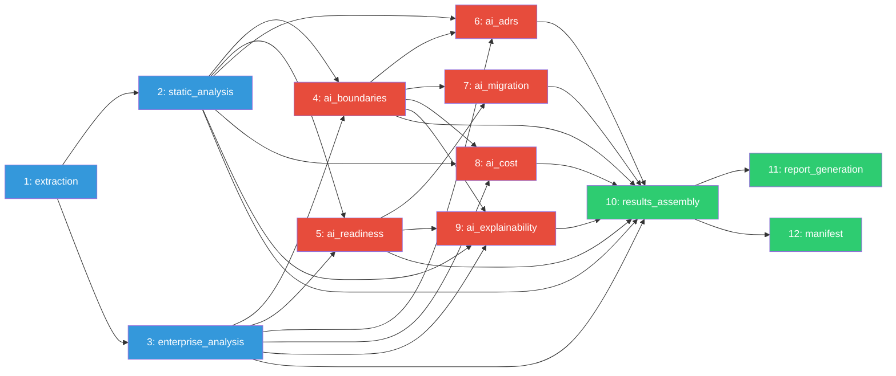
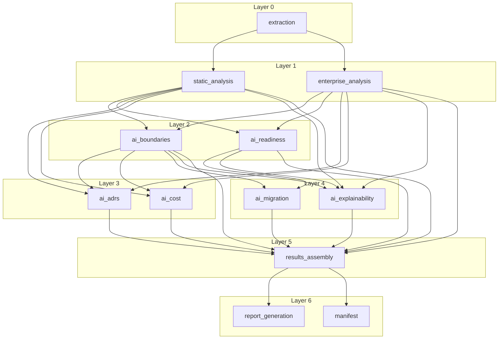
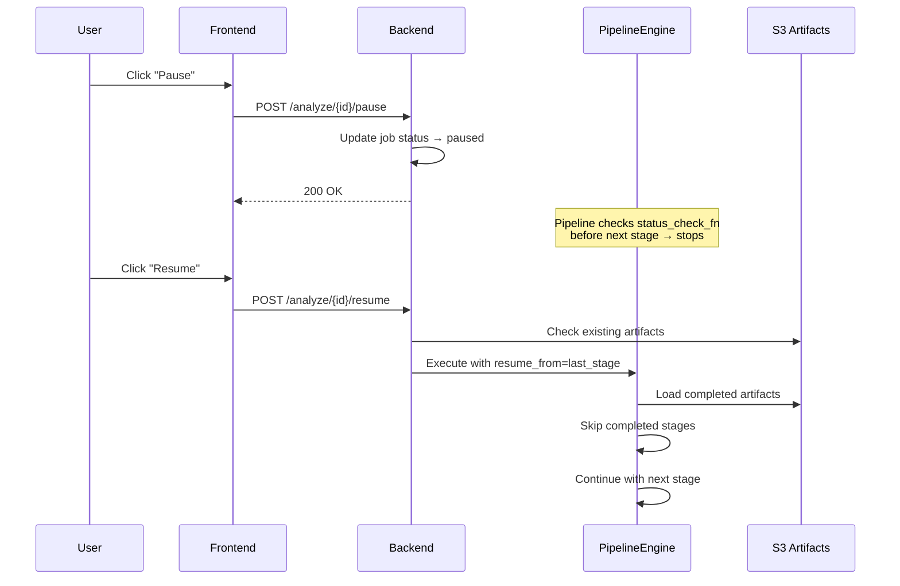

# Pipeline

## 12-Stage Analysis Pipeline

---

## Overview

All 12 pipeline stages are implemented in `backend/app/pipeline/stages/`. Each stage extends either `PipelineStage` (non-AI stages) or `BaseAIStage` (AI stages) and produces a versioned `Artifact` stored via `ArtifactRepository`.

The pipeline supports two execution models:
- **Sequential** (default) — stages execute in order, one at a time
- **Parallel** — DAG-based execution with concurrent independent stages

---

## Stage Dependency Graph



---

## Parallel Execution Layers

The DAG builder groups stages into layers. Stages in the same layer can run concurrently.

```
Layer 0: [extraction]
Layer 1: [static_analysis, enterprise_analysis]              ← parallel
Layer 2: [ai_boundaries, ai_readiness]                       ← parallel
Layer 3: [ai_adrs, ai_cost]                                  ← parallel
Layer 4: [ai_migration, ai_explainability]                   ← parallel
Layer 5: [results_assembly]
Layer 6: [report_generation, manifest]                        ← parallel
```

---

## Stage Details

### Stage 1: extraction

| Property | Value |
|----------|-------|
| **Purpose** | Downloads uploaded ZIP from S3, extracts to temp directory, captures metadata |
| **Input** | S3 key `jobs/{id}/raw/{file}.zip` |
| **Output** | Artifact with `extracted_path`, `zip_key`, `zip_size_bytes` |
| **Dependencies** | None |
| **Requires AI** | No |
| **Key logic** | Lists objects in S3 under `jobs/{id}/raw/`, finds `.zip`, downloads, extracts to `tempfile.mkdtemp()`, stores path for downstream stages |
| **File** | `backend/app/pipeline/stages/extraction.py:ExtractionStage` |

**Artifact schema:**
```json
{
  "extracted_path": "/tmp/...",
  "zip_key": "jobs/{id}/raw/code.zip",
  "zip_size_bytes": 123456
}
```

---

### Stage 2: static_analysis

| Property | Value |
|----------|-------|
| **Purpose** | Regex-based Java static analysis: classes, endpoints, dependencies, god classes, circular dependencies |
| **Input** | `extracted_path` from extraction stage |
| **Output** | Artifact with `classes[]`, `endpoints[]`, `dependency_edges[]`, `metrics{}`, `package_tree{}` |
| **Dependencies** | extraction |
| **Requires AI** | No |
| **Key logic** | Calls `app.services.static_analyzer.analyze_java_codebase()` — regex-based Java parser that identifies classes, annotations (Spring Boot), fields, endpoints, dependencies, detects god classes (>20 methods), and circular dependencies |
| **File** | `backend/app/pipeline/stages/static_analysis.py:StaticAnalysisStage` |

**Artifact schema (key fields):**
```json
{
  "classes": [{"name": "", "package": "", "file_path": "", "lines_of_code": 0,
    "method_count": 0, "annotations": [], "imports": [], "dependencies": [],
    "extends": "", "implements": [], "injected_fields": [],
    "fields": [], "is_entity": false, "is_controller": false,
    "is_service": false, "is_repository": false}],
  "endpoints": [{"method": "GET", "path": "/api/...",
    "handler_class": "Ctrl", "handler_method": "method", "annotations": []}],
  "dependency_edges": [],
  "metrics": {"total_classes": 0, "total_methods": 0, "total_lines": 0,
    "god_classes": [], "circular_dependencies": []},
  "package_tree": {}
}
```

---

### Stage 3: enterprise_analysis

| Property | Value |
|----------|-------|
| **Purpose** | Plugin-based enterprise analysis with 10 analyzers |
| **Input** | `extracted_path` from extraction stage |
| **Output** | Full `AnalysisResult` with architecture summary, quality metrics, readiness scores, risk report, dependency graph, candidate services, bounded contexts |
| **Dependencies** | extraction |
| **Requires AI** | No |
| **Key logic** | Calls `app.services.analysis_engine.run_analysis()` which uses `AnalysisEngine` with 10 registered analyzers executed in phase order: scanner → parser → metrics → quality → dependency → architecture → risk → readiness → recommendation → graph |
| **File** | `backend/app/pipeline/stages/enterprise_analysis.py:EnterpriseAnalysisStage` |

**10 Analyzers:**

| Analyzer | Phase | Purpose |
|----------|-------|---------|
| `ProjectScanner` | scanner | Scans project structure, detects build files, modules |
| `JavaParser` | parser | Parses Java files, extracts AST-level info |
| `CodeMetricsAnalyzer` | metrics | LOC, class counts, method counts, complexity |
| `QualityMetricsAnalyzer` | quality | Maintainability, cohesion, coupling scores |
| `DependencyAnalyzer` | dependency | Builds dependency graph, detects circular deps |
| `ArchitectureDetector` | architecture | Detects architecture style, layering, patterns |
| `RiskDetector` | risk | Identifies risk findings (critical, high, medium, low) |
| `CloudReadinessAnalyzer` | readiness | Scores readiness across 8 dimensions |
| `RecommendationEngine` | recommendation | Generates architecture recommendations |
| `GraphGenerator` | graph | Builds visualization graphs (architecture, dependencies) |

---

### Stage 4: ai_boundaries

| Property | Value |
|----------|-------|
| **Purpose** | Microservice boundary detection |
| **Input** | static_analysis classes/endpoints/deps + enterprise_analysis candidate_services/bounded_contexts |
| **Output** | `services[]` with name, description, cohesion/coupling scores, classes, packages, API endpoints, confidence, readiness, risk |
| **Dependencies** | static_analysis, enterprise_analysis |
| **Requires AI** | Yes — invokes Bedrock (Nova Pro) |
| **Key logic** | Delegates to `app.ai.orchestrator.analyze_service_boundaries()` — builds service candidates from enterprise analysis, enriches with class data and endpoint data, produces confidence-scored service boundaries. If AI discovery fails, falls back to a monolith service from all classes |
| **Fallback** | `{"services": [], "summary": "Boundary detection unavailable"}` |
| **File** | `backend/app/pipeline/stages/ai_boundaries.py:AIBoundariesStage` |

---

### Stage 5: ai_readiness

| Property | Value |
|----------|-------|
| **Purpose** | 6-dimension readiness scoring with evidence |
| **Input** | static_analysis metrics + enterprise_analysis readiness scores |
| **Output** | 6 dimensions: code_quality, architecture, cloud_readiness, service_separation, database_coupling, documentation. Each with score + evidence |
| **Dependencies** | static_analysis, enterprise_analysis |
| **Requires AI** | No — deterministic scoring (model id `sprint3-deterministic`) |
| **Key logic** | Maps Sprint 2 readiness dimensions (compute, database, networking, etc.) to frontend-expected dimensions (code_quality, architecture, etc.). Uses actual metrics: god class penalty, circular dep penalty, package structure, entity count |
| **Fallback** | `DEFAULT_READINESS` (all dimensions at 50, overall 50, confidence 0.6) |
| **File** | `backend/app/pipeline/stages/ai_readiness.py:AIReadinessStage` |

---

### Stage 6: ai_adrs

| Property | Value |
|----------|-------|
| **Purpose** | Architecture Decision Record generation |
| **Input** | Service boundaries + static analysis data |
| **Output** | `adrs[]` — each with title, context, decision, alternatives, tradeoffs, consequences |
| **Dependencies** | static_analysis, enterprise_analysis, ai_boundaries |
| **Requires AI** | Yes — invokes Bedrock (Nova Pro) |
| **Key logic** | Calls `app.ai.orchestrator.generate_adrs()` → delegates to `AIService.generate_adrs()` → `AIADRGenerator` which produces typed ADR contracts (`app.ai.contracts.adr`) |
| **Fallback** | `{"adrs": []}` |
| **File** | `backend/app/pipeline/stages/ai_adrs.py:AIADRStage` |

---

### Stage 7: ai_migration

| Property | Value |
|----------|-------|
| **Purpose** | Migration wave planning |
| **Input** | Service boundaries + readiness scores |
| **Output** | `waves[]` with wave_number, name, services, timeline_weeks, estimated_engineers, dependencies, risk_level, migration_complexity |
| **Dependencies** | ai_boundaries, ai_readiness |
| **Requires AI** | No — deterministic algorithm (model id `sprint3-deterministic`) |
| **Key logic** | Sorts services by confidence (highest first = easiest to extract). For each service: calculates timeline (2-12 weeks based on class count), engineers needed (2-8 based on class count), risk level from coupling and confidence, and dependency ordering |
| **Fallback** | `{"waves": [], "total_weeks": 0, "recommended_order": []}` |
| **File** | `backend/app/pipeline/stages/ai_migration.py:AIMigrationStage` |

---

### Stage 8: ai_cost

| Property | Value |
|----------|-------|
| **Purpose** | Cost estimation (current vs post-migration) |
| **Input** | Static analysis metrics + service boundaries |
| **Output** | `current_monthly`, `post_migration_monthly`, `monthly_savings`, `annual_savings`, `one_time_cost`, `payback_months`, breakdowns |
| **Dependencies** | static_analysis, enterprise_analysis, ai_boundaries |
| **Requires AI** | No — deterministic estimate (model id `sprint3-deterministic`); never calls Bedrock |
| **Key logic** | Infrastructure cost comes from **real AWS Pricing API on-demand rates** (t3.medium, db.t3.small, gp3) for an assumed footprint when `EMIP_AWS_PRICING_ENABLED=true` + credentials + known region; otherwise falls back to `$1.50/1000 LOC` formula. Operations `$0.80/class` and maintenance are fixed engineering-labor formulas. Post-migration assumes 45% infra savings, 25% ops savings. One-time cost = god classes * $500 + circular deps * $300 + services * $1000. `migration_impact.pricing_source` = `aws-pricing-api` or `estimate-formulas` |
| **Fallback** | `DEFAULT_COST` (all zeros, payback 24 months) |
| **File** | `backend/app/pipeline/stages/ai_cost.py:AICostStage` |

---

### Stage 9: ai_explainability

| Property | Value |
|----------|-------|
| **Purpose** | Confidence breakdown, risk heatmap, reasoning |
| **Input** | Service boundaries + readiness + analysis data |
| **Output** | `recommendations[]` with service, confidence, primary_reason, secondary_reasons, evidence, migration_complexity + `business_capabilities[]` |
| **Dependencies** | static_analysis, enterprise_analysis, ai_boundaries, ai_readiness |
| **Requires AI** | No — deterministic reasoning (model id `sprint3-deterministic`) |
| **Key logic** | For each service boundary: builds evidence from classes, packages, cohesion, coupling. Generates primary/secondary reasons. Extracts business capabilities from bounded contexts |
| **Fallback** | `{"recommendations": [], "business_capabilities": [], "risk_heatmap": []}` |
| **File** | `backend/app/pipeline/stages/ai_explainability.py:AIExplainabilityStage` |

---

### Stage 10: results_assembly

| Property | Value |
|----------|-------|
| **Purpose** | Collect all stage outputs into unified result |
| **Input** | All preceding stage artifacts |
| **Output** | Unified `full_results` dict with job_id, metrics, service_boundaries, readiness, ADRs, migration waves, cost comparison, explainability, Sprint 2 analysis |
| **Dependencies** | static_analysis, enterprise_analysis, ai_boundaries, ai_readiness, ai_adrs, ai_migration, ai_cost, ai_explainability |
| **Requires AI** | No |
| **Key logic** | Aggregates artifacts: extracts service boundaries (enriched with class/package/endpoint data), readiness, ADRs, migration waves, cost, explainability, Sprint 2 data into a single JSON document |
| **File** | `backend/app/pipeline/stages/results_assembly.py:ResultsAssemblyStage` |

---

### Stage 11: report_generation

| Property | Value |
|----------|-------|
| **Purpose** | Build executive reports and financial analysis |
| **Input** | Assembled results from results_assembly |
| **Output** | Structured reports: executive summary, developer report, financial analysis |
| **Dependencies** | results_assembly |
| **Requires AI** | No |
| **Key logic** | Delegates to `app.reports.builders.build_all_reports()` which produces typed report objects |
| **File** | `backend/app/pipeline/stages/report_generation.py:ReportGenerationStage` |

---

### Stage 12: manifest

| Property | Value |
|----------|-------|
| **Purpose** | Deployment manifest with artifact inventory |
| **Input** | All stage artifacts + pipeline state |
| **Output** | `ArtifactManifest` with artifact metadata list, pipeline state, AI summary (total tokens, cost, degraded stages, deterministic fallbacks) |
| **Dependencies** | results_assembly |
| **Requires AI** | No |
| **Key logic** | Iterates all completed stages, collects artifact metadata, computes total tokens and cost, identifies any degraded stages, builds `ArtifactManifest` (job_id, project_name, timing, artifacts[], reports[], ai_summary) |
| **File** | `backend/app/pipeline/stages/manifest.py:ManifestStage` |

---

## Execution Models

### Sequential (Default)

```python
# backend/app/pipeline/stages/engine.py
executor = SequentialExecutor(stages=stages, artifact_repo=artifact_repo)
state = executor.execute(job_id=job_id, ...)
```

Stages execute in list order. Each stage must complete before the next starts. Simple, predictable, minimal overhead.

### Parallel (DAG-Based)

```python
executor = ParallelExecutor(stages=stages, artifact_repo=artifact_repo, max_workers=4)
state = executor.execute(job_id=job_id, ...)
```



The `DAGBuilder` (`backend/app/scheduling/dag.py`):
1. Reads each stage's `depends_on` property
2. Builds adjacency graph
3. Validates for cycles via `CycleValidator`
4. Computes execution layers via topological sort (Kahn's algorithm)
5. Within each layer, stages execute concurrently via `ThreadPoolExecutor`

---

## Failure Handling

### Fallback Chain (2-step)

Implemented in `BaseAIStage.execute()` (`backend/app/pipeline/stages/base.py`):

```python
class BaseAIStage(PipelineStage):
    def execute(self, context: PipelineContext) -> Artifact:
        try:
            result, model_id = self.execute_ai(context)        # Step 1: AI
            if not result:
                result = self.fallback()                        # empty → deterministic fallback
                is_degraded = True
        except Exception:
            result = self.fallback()                            # error → deterministic fallback
            is_degraded = True
        # Step 2 complete: pipeline continues with degraded flag
        return Artifact(metadata=..., is_degraded=is_degraded, ...)
```

This is a 2-step chain (AI → single deterministic fallback). There is no retry-with-reduced-context step.

Each AI stage defines:
- `execute_ai()` — the AI invocation (may raise or return empty)
- `fallback()` — deterministic default result

The degraded flag propagates to the manifest stage, which reports all degraded stages in `ai_summary.degraded_stages`.

### Per-Stage Error Handling

Non-AI stages fail immediately with a descriptive error. The pipeline records the failure in `PipelineState.errors` and continues if the stage is non-critical. The manifest reports any failures.

### Pipeline Cancel/Pause

The `status_check_fn` callback is invoked before each stage. If it returns `"paused"` or `"cancelled"`, the pipeline stops mid-execution:
- **Pause**: Pipeline state is saved; resume from last completed stage via `resume_from` parameter
- **Cancel**: Pipeline state is saved as cancelled; user can delete the job

---

## Checkpoint/Resume



### How Checkpointing Works

1. After each stage completes, `ArtifactRepository.save()` persists the artifact to S3 at `jobs/{id}/artifacts/{stage_name}.json`
2. Metadata is saved at `jobs/{id}/artifacts/{stage_name}.meta.json`
3. On resume, the executor checks which stages have artifacts, loads them, and marks them as `CACHED`
4. Execution starts from the first incomplete stage

### Resume API

```python
# POST /api/analyze/{id}/resume
pipeline_engine.execute(
    job_id=job_id,
    resume_from=last_completed_stage,   # Stage name to resume from
    status_check_fn=check_status,        # Check for pause/cancel
    progress_callback=update_progress,   # Update frontend
)
```
