# AWS Infrastructure

## Account: 479752407378 · Region: us-east-1

---

## Architecture Diagram

```mermaid
graph TB
    subgraph UserLayer["User Layer"]
        BROWSER["Browser (React SPA on localhost:5173)"]
    end

    subgraph APILayer["API Layer"]
        API["Amazon API Gateway<br/>REST API"]
        CORS["CORS Enabled<br/>origins: localhost:5173, :3000"]
        BINARY["Binary Media Support"]
    end

    subgraph BackendLambda["Lambda: emip-backend-dev"]
        BH["Handler (Mangum)<br/>1024 MB / 120s timeout"]
        BE_LAYER["Lambda Layer: emip-deps-dev:6<br/>FastAPI, Mangum, structlog, pydantic"]
    end

    subgraph WorkerLambda["Lambda: emip-worker-dev"]
        WH["Worker Handler<br/>2048 MB / 600s timeout"]
        WE_LAYER["Lambda Layer: emip-deps-dev:6"]
        XRAY["X-Ray Tracing<br/>(configurable)"]
    end

    subgraph Storage["Storage Layer"]
        S3_CODE["S3: emip-code-dev<br/>Upload Storage<br/>SSE-S3 · Versioning"]
        S3_ART["S3: emip-artifacts-dev-479752407378<br/>Artifact Storage<br/>SSE-S3 · Lifecycle Policies"]
        DDB_JOBS["DynamoDB: emip-jobs-dev<br/>PK: job_id<br/>Job State + Progress"]
        DDB_ANALYSIS["DynamoDB: emip-analysis-dev<br/>PK: job_id, SK: analysis_type<br/>Analysis Results"]
    end

    subgraph Messaging["Messaging Layer"]
        SQS_Q["SQS: emip-analysis-queue-dev<br/>Visibility Timeout: 660s"]
        SQS_DLQ["SQS: emip-analysis-dlq-dev<br/>DLQ after 3 retries"]
        SNS["SNS: emip-notifications-dev<br/>Email notifications"]
        EB["EventBridge: emip-events-dev<br/>Pipeline lifecycle events"]
    end

    subgraph AILayer["AI Layer"]
        BEDROCK["Amazon Bedrock<br/>Nova Pro / Nova Lite / Nova Micro<br/>Converse API"]
    end

    subgraph Observability["Observability"]
        CW_BE["CloudWatch Log: /emip/backend"]
        CW_W["CloudWatch Log: /emip/worker"]
        CW_METRICS["CloudWatch Metrics"]
        XRAY_SVC["X-Ray Service Map"]
    end

    subgraph IAM["IAM Roles & Policies"]
        BE_ROLE["BackendRole<br/>S3, DynamoDB, SQS, SNS, EventBridge, Bedrock"]
        WE_ROLE["WorkerRole<br/>S3, DynamoDB, Bedrock, SNS, EventBridge"]
    end

    BROWSER -->|HTTPS| API
    API --> BackendLambda
    BackendLambda --> BE_ROLE
    BackendLambda -->|PutObject| S3_CODE
    BackendLambda -->|GetItem/PutItem/UpdateItem| DDB_JOBS
    BackendLambda -->|SendMessage| SQS_Q
    BackendLambda -->|Publish| SNS
    BackendLambda -->|PutEvents| EB
    SQS_Q --> WH
    SQS_Q -->|3 retries →| SQS_DLQ
    WorkerLambda --> WE_ROLE
    WH --> BE_LAYER
    WH -->|Download/Upload| S3_CODE
    WH -->|Save/Load Artifacts| S3_ART
    WH -->|Update Job State| DDB_JOBS
    WH -->|Save Analysis Results| DDB_ANALYSIS
    WH -->|InvokeModel| BEDROCK
    WH -->|Publish| SNS
    WH -->|PutEvents| EB
    WorkerLambda -->|Logs| CW_W
    BackendLambda -->|Logs| CW_BE
    WorkerLambda -.->|X-Ray| XRAY_SVC

    style UserLayer fill:#4a90d9,color:#fff
    style APILayer fill:#50b86c,color:#fff
    style BackendLambda fill:#e67e22,color:#fff
    style WorkerLambda fill:#9b59b6,color:#fff
    style Storage fill:#2c3e50,color:#fff
    style Messaging fill:#16a085,color:#fff
    style AILayer fill:#e74c3c,color:#fff
    style Observability fill:#7f8c8d,color:#fff
    style IAM fill:#34495e,color:#fff
```



---

## Services

### S3

| Property | `emip-code-dev` | `emip-artifacts-dev-479752407378` |
|----------|----------------|-----------------------------------|
| **Purpose** | Uploaded ZIP storage | Versioned artifact storage |
| **Encryption** | SSE-S3 (AES-256) | SSE-S3 (AES-256) |
| **Versioning** | Enabled | Enabled |
| **Lifecycle** | Standard | Transition to IA after 30d, expire after 365d |
| **Access** | Backend Lambda only | Worker Lambda only |

**Key prefixes:**
```
jobs/{job_id}/raw/          → Uploaded ZIP files
jobs/{job_id}/artifacts/    → Stage artifacts (*.json, *.meta.json)
jobs/{job_id}/artifacts/manifest.json  → Final manifest
```

### Lambda

| Property | `emip-backend-dev` | `emip-worker-dev` |
|----------|-------------------|-------------------|
| **Memory** | 1024 MB | 2048 MB |
| **Timeout** | 120 seconds | 600 seconds |
| **Runtime** | Python 3.14 | Python 3.14 |
| **Handler** | `handler.handler` | `worker_handler.handler` |
| **Trigger** | API Gateway (REST) | SQS EventSourceMapping |
| **Layer** | `emip-deps-dev:6` | `emip-deps-dev:6` |
| **Current version** | v8 | v8 |
| **Log group** | `/emip/backend` | `/emip/worker` |

### API Gateway

| Property | Value |
|----------|-------|
| **Type** | REST API |
| **CORS** | Enabled (origins: localhost:5173, localhost:3000) |
| **Binary Media** | Enabled (for ZIP upload) |
| **Endpoints** | 13 REST routes |

**Routes:**

| Method | Path | Handler |
|--------|------|---------|
| POST | `/api/upload` | Backend Lambda |
| POST | `/api/analyze/{id}` | Backend Lambda |
| POST | `/api/analyze/{id}/pause` | Backend Lambda |
| POST | `/api/analyze/{id}/resume` | Backend Lambda |
| POST | `/api/analyze/{id}/cancel` | Backend Lambda |
| GET | `/api/results/{id}` | Backend Lambda |
| GET | `/api/results/{id}/artifacts` | Backend Lambda |
| GET | `/api/jobs` | Backend Lambda |
| GET | `/api/jobs/{id}` | Backend Lambda |
| POST | `/api/deploy` | Backend Lambda |
| GET | `/health` | Backend Lambda |
| GET | `/api/settings` | Backend Lambda |
| GET | `/api/ai/health` | Backend Lambda |

### DynamoDB

#### `emip-jobs-dev`

| Attribute | Type | Description |
|-----------|------|-------------|
| `job_id` | String (PK) | UUID formatted job identifier |
| `status` | String | created, queued, running, completed, failed, paused, cancelled |
| `progress` | Number | 0-95 (95+ means done, 100 means results rendered) |
| `current_stage` | String | Name of active pipeline stage |
| `created_at` | String | ISO 8601 timestamp |
| `completed_at` | String | ISO 8601 timestamp |
| `ttl` | Number | DynamoDB TTL for auto-expiry |

#### `emip-analysis-dev`

| Attribute | Type | Description |
|-----------|------|-------------|
| `job_id` | String (PK) | Partition key |
| `analysis_type` | String (SK) | Sort key (e.g., "static", "enterprise", "boundaries") |
| `content` | String | JSON-serialized analysis result |
| `created_at` | String | ISO 8601 timestamp |

**Billing:** Both tables use `PAY_PER_REQUEST` on-demand capacity.

### SQS

| Property | `emip-analysis-queue-dev` | `emip-analysis-dlq-dev` |
|----------|--------------------------|-------------------------|
| **Type** | Standard | Standard |
| **Visibility Timeout** | 660 seconds | — |
| **Message Retention** | 4 days | 14 days |
| **Redrive Policy** | maxReceiveCount: 3 | — |
| **DLQ Target** | — | Receives after 3 failed deliveries |

### SNS

| Property | Value |
|----------|-------|
| **Topic** | `emip-notifications-dev` |
| **Protocol** | Email (subscription required) |
| **Triggers** | Pipeline completion, pipeline failure |

### EventBridge

| Property | Value |
|----------|-------|
| **Bus** | `emip-events-dev` |
| **Events** | Pipeline lifecycle: started, stage_completed, completed, failed, paused, cancelled |

**Wiring (SAM template):** a rule `emip-pipeline-notifications-<env>` matches terminal + failure events (`pipeline.completed`, `pipeline.failed`, `pipeline.stage.failed`) on the custom bus and forwards them to the SNS topic via a `Target`. A `NotificationTopicPolicy` grants the event bus's service principal `sns:Publish` on the topic (scoped by `aws:SourceArn`). An email `Subscription` is created only when the `NotificationEmail` parameter is set — confirm the pending subscription in the AWS console after deploy. Backend publishes events via `app/services/events.py` → `app/aws/eventbridge.py`.

**Event schema:**
```json
{
  "source": "emip.pipeline",
  "detail-type": "pipeline.completed",
  "detail": {
    "job_id": "...",
    "status": "completed",
    "total_duration_ms": 12345,
    "stages_completed": ["extraction", "static_analysis", ...],
    "degraded_stages": []
  }
}
```

### CloudWatch

| Resource | Configuration |
|----------|--------------|
| **Log group `/emip/backend`** | Retention: 30 days |
| **Log group `/emip/worker`** | Retention: 30 days |
| **X-Ray tracing** | Configurable via `ENABLE_XRAY` env var (default: off) |

### IAM

**Backend Role** — Minimal permissions for API operations:
- S3: GetObject, PutObject, ListBucket on job uploads
- DynamoDB: GetItem, PutItem, UpdateItem, Query on jobs table
- SQS: SendMessage on analysis queue
- SNS: Publish on notification topic
- EventBridge: PutEvents

**Worker Role** — Extended permissions for analysis:
- S3: Full read/write on artifact bucket, read on upload bucket
- DynamoDB: Full CRUD on both tables
- Bedrock: InvokeModel on all models
- SNS: Publish on notification topic
- EventBridge: PutEvents
- CloudWatch: PutMetricData, CreateLogStream, PutLogEvents

### Lambda Layer

**Name:** `emip-deps-dev:6`

**Packages included:**
- fastapi
- mangum
- structlog
- pydantic
- pydantic-settings
- boto3
- python-multipart
- aiofiles

---

## Deployment

### SAM (canonical)

```bash
cd infrastructure
sam build
sam deploy --guided
# Uses template.yaml and samconfig.toml
```

### CDK (Experimental / Legacy — do not deploy)

`infrastructure/app.py` is kept for reference only and is NOT a supported
deployment path: it lacks the SQS worker, DLQ, SNS and EventBridge resources,
and its ALB is HTTP-only. Resources use RETAIN removal policies. Use SAM
above.

---

## Environment Variables

| Variable | Default | Purpose |
|----------|---------|---------|
| `APP_NAME` | EMIP | Application name |
| `APP_VERSION` | 1.0.0 | Application version |
| `DEBUG` | false | Debug mode |
| `ENVIRONMENT` | dev | Deployment environment |
| `AWS_REGION` | us-east-1 | AWS region |
| `AWS_ACCOUNT_ID` | — | AWS account ID |
| `S3_BUCKET` | emip-artifacts | Artifact storage bucket |
| `S3_MAX_UPLOAD_SIZE_MB` | 100 | Max upload size |
| `DYNAMODB_JOBS_TABLE` | emip-jobs | Jobs table name |
| `DYNAMODB_ANALYSIS_TABLE` | emip-analysis | Analysis table name |
| `ANALYSIS_MODE` | fast | Analysis profile (fast/normal/deep/benchmark) |
| `BEDROCK_MODEL_PRIMARY` | amazon.nova-pro-v1:0 | Primary Bedrock model |
| `BEDROCK_MODEL_FALLBACK` | amazon.nova-lite-v1:0 | Fallback Bedrock model |
| `BEDROCK_MODEL_CODEGEN` | amazon.nova-pro-v1:0 | Code generation model |
| `BEDROCK_MAX_TOKENS` | 8000 | Max response tokens (NORMAL mode) |
| `BEDROCK_MAX_RETRIES` | 3 | Max retry attempts |
| `SQS_ANALYSIS_QUEUE` | emip-analysis-queue | Analysis queue name |
| `SQS_ANALYSIS_DLQ` | emip-analysis-dlq | Dead letter queue name |
| `SNS_NOTIFICATION_TOPIC` | emip-notifications | Notification topic name |
| `API_KEY` | — | API key for auth (empty = disabled) |
| `CORS_ORIGINS` | ["localhost:5173"] | Allowed CORS origins |
| `LOG_LEVEL` | INFO | Logging level |
| `ENABLE_XRAY` | false | Enable X-Ray tracing |
| `AI_MODEL_ID` | — | Override AI model (empty = use primary) |
| `AI_TEMPERATURE` | 0.0 | AI model temperature |
| `AI_MAX_RETRIES` | 3 | AI max retry attempts |
| `AI_RESPONSE_CACHE_TTL` | 3600 | AI cache TTL (seconds) |
| `AI_ENABLE_COST_TRACKING` | true | Enable cost tracking |
| `AI_ENABLE_OBSERVABILITY` | true | Enable observability |
| `AI_PROMPT_MAX_TOKENS` | 7000 | Max prompt tokens (NORMAL mode) |
| `AI_MIN_CONFIDENCE` | 0.3 | Min confidence threshold |
| `EVENTBRIDGE_BUS_NAME` | emip-events | EventBridge bus name |
| `WORKER_CONCURRENCY` | 10 | Max concurrent workers |
| `CHECKPOINT_ENABLED` | true | Enable checkpointing |
| `ARTIFACT_VERSION` | 1.0.0 | Artifact format version |
| `AWS_PRICING_ENABLED` | false | Use AWS Pricing API for `ai_cost` infra rates (falls back to fixed formulas when off/offline) |
| `AWS_PRICING_REGION` | us-east-1 | Region for the Pricing API client (global endpoint: us-east-1 or ap-south-1) |
| `AWS_PRICING_CACHE_TTL` | 86400 | Pricing rate cache TTL (seconds) |

---

## Security

| Measure | Implementation |
|---------|---------------|
| **Encryption at rest** | SSE-S3 (AES-256) on all buckets |
| **Encryption in transit** | HTTPS via API Gateway |
| **Authentication** | API key middleware (optional, env var `API_KEY`) |
| **Authorization** | IAM roles with least-privilege policies |
| **Input validation** | ZIP content validation (rejects empty archives), file type checks |
| **Secrets management** | No secrets in code; all via env vars / .env |
