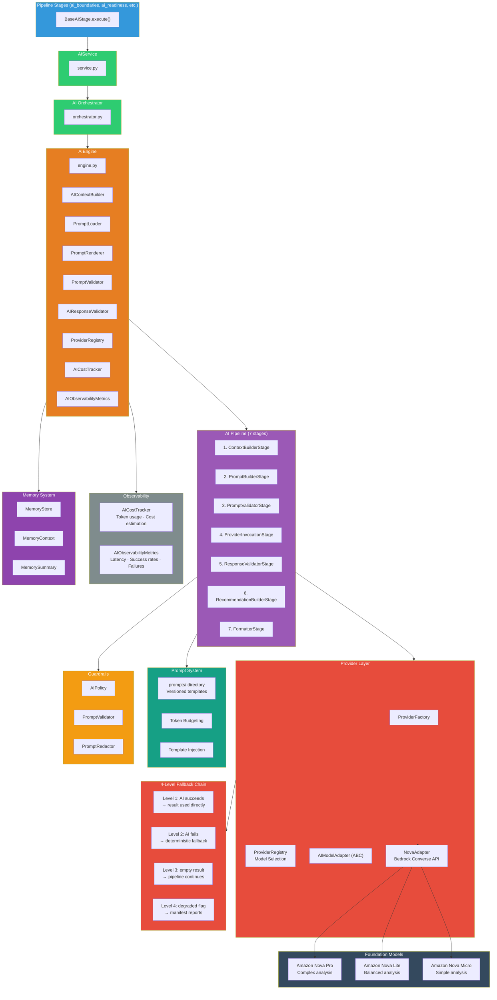
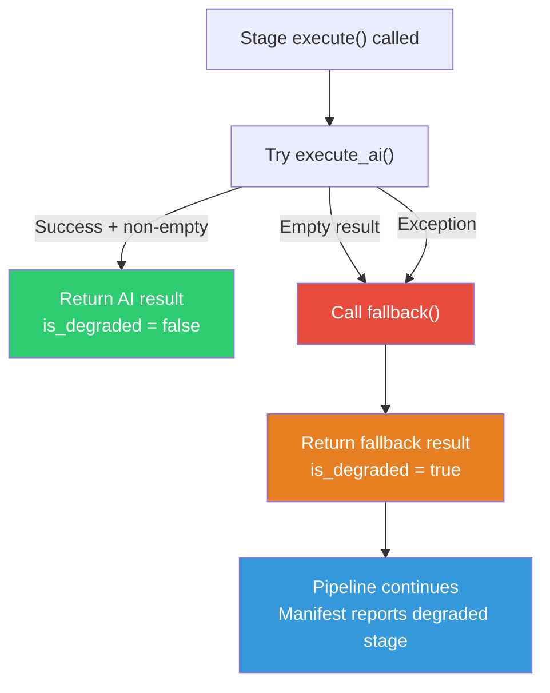

# AI System

## Sprint 3 — AI Layer (Amazon Bedrock)

---

## Overview

The AI layer provides intelligent analysis for the pipeline via Amazon Bedrock (Nova Pro, Nova Lite, Nova Micro). It is designed around a provider abstraction pattern with a 4-level fallback chain, ensuring the pipeline never hard-fails on AI errors.

### Key Files

```
backend/app/ai/
├── engine.py                  # AIEngine — central orchestrator
├── orchestrator.py            # AIOrchestrator — drop-in replacements
├── service.py                 # AIService — entry point for pipeline stages
├── provider/
│   ├── adapter.py             # AIModelAdapter (ABC), AIModelRequest, AIModelResponse
│   ├── config.py              # AIModelConfig
│   ├── factory.py             # ProviderFactory
│   ├── nova.py                # NovaAdapter (Bedrock Converse)
│   └── registry.py            # ProviderRegistry
├── pipeline/
│   └── stages.py              # AIPipeline — 7 internal AI pipeline stages
├── context/
│   └── builder.py             # AIContextBuilder
├── contracts/
│   ├── adr.py                 # AIADR contract
│   ├── executive.py           # AIExecutiveSummary contract
│   ├── developer.py           # AIDeveloperReport contract
│   ├── migration.py           # AIMigrationPlan contract
│   └── recommendation.py      # AIRecommendation contract
├── guardrails/
│   ├── policy.py              # AIPolicy
│   ├── validator.py           # PromptValidator
│   └── redaction.py           # PromptRedactor
├── cost/
│   └── tracker.py             # AICostTracker
├── observability/
│   └── metrics.py             # AIObservabilityMetrics
├── memory/
│   ├── context.py             # MemoryContext
│   ├── store.py               # MemoryStore
│   └── summary.py             # MemorySummary
├── discovery/
│   └── engine.py              # AIMicroserviceDiscovery
├── planner/
│   └── engine.py              # AIMigrationPlanner
├── recommendation/
│   └── engine.py              # AIRecommendationEngine
├── reports/
│   ├── executive.py           # AIExecutiveSummaryGenerator
│   └── developer.py           # AIDeveloperReportGenerator
├── adr/
│   └── generator.py           # AIADRGenerator
├── explainability/
│   └── ...                    # Explainability generation
└── validation/
    └── validator.py           # AIResponseValidator
```

---

## Architecture



---

## AI Pipeline Stages

The AI layer has its own internal pipeline (`backend/app/ai/pipeline/stages.py`) with 7 stages:

```mermaid
flowchart LR
    CB[1: ContextBuilder<br/>Build AI-ready context<br/>from analysis data] -->
    PB[2: PromptBuilder<br/>Render template<br/>with variables] -->
    PV[3: PromptValidator<br/>Validate & sanitize<br/>prompt content] -->
    PI[4: ProviderInvocation<br/>Invoke foundation<br/>model via registry] -->
    RV[5: ResponseValidator<br/>Parse & validate<br/>model response] -->
    RB[6: RecommendationBuilder<br/>Build typed<br/>recommendation objects] -->
    F[7: Formatter<br/>Format final output<br/>for storage]

    style CB fill:#3498db,color:#fff
    style PB fill:#2980b9,color:#fff
    style PV fill:#f39c12,color:#fff
    style PI fill:#e74c3c,color:#fff
    style RV fill:#2ecc71,color:#fff
    style RB fill:#27ae60,color:#fff
    style F fill:#1abc9c,color:#fff
```



| # | Stage | Class | Purpose |
|---|-------|-------|---------|
| 1 | ContextBuilder | `ContextBuilderStage` | Build `AIContext` from static analysis data |
| 2 | PromptBuilder | `PromptBuilderStage` | Render prompt template with context variables |
| 3 | PromptValidator | `PromptValidatorStage` | Validate and sanitize prompt content |
| 4 | ProviderInvocation | `ProviderInvocationStage` | Invoke foundation model via ProviderRegistry |
| 5 | ResponseValidator | `ResponseValidatorStage` | Validate and parse model response |
| 6 | RecommendationBuilder | `RecommendationBuilderStage` | Build typed recommendation objects |
| 7 | Formatter | `FormatterStage` | Format final output for storage and API |

The `AIPipeline` class orchestrates these stages:

```python
pipeline = AIPipeline()
pipeline.add_stages([
    ContextBuilderStage(context_builder),
    PromptBuilderStage(prompt_renderer),
    PromptValidatorStage(prompt_validator),
    ProviderInvocationStage(provider_registry),
    ResponseValidatorStage(response_validator),
    RecommendationBuilderStage(),
    FormatterStage(),
])
result = pipeline.execute(initial_state)
```

---

## Provider Abstraction

### AIModelAdapter (ABC)

```python
class AIModelAdapter(ABC):
    def invoke(self, request: AIModelRequest) -> AIModelResponse: ...
    def health_check(self) -> bool: ...
    def supported_features(self) -> list[str]: ...
```

### NovaAdapter

The primary implementation (`backend/app/ai/provider/nova.py`):

```python
class NovaAdapter(AIModelAdapter):
    def invoke(self, request: AIModelRequest) -> AIModelResponse:
        # Uses Bedrock Converse API
        response = self._bedrock.converse(
            modelId=model_id,
            messages=[{"role": "user", "content": [{"text": request.prompt}]}],
            inferenceConfig={"maxTokens": ..., "temperature": ...},
        )
        # Extracts text, tokens, parses response
        return AIModelResponse(text=..., input_tokens=..., output_tokens=...)
```

### ProviderFactory & ProviderRegistry

```python
class ProviderFactory:
    def create(self, config: AIModelConfig) -> AIModelAdapter:
        if "nova" in config.provider:
            return NovaAdapter(config)
        # Supports Claude, Mistral, Llama adapters

class ProviderRegistry:
    def invoke(self, request: AIModelRequest, model_id: str | None = None) -> AIModelResponse:
        # Selects adapter, invokes, handles retry
```

---

## Fallback Chain



**4 levels:**
1. AI succeeds → result used directly
2. AI fails (exception/empty) → deterministic fallback
3. Empty fallback → pipeline continues
4. All stages complete → manifest reports degraded stages

---

## Prompt System

### Location

Versioned prompt templates are stored in `backend/app/prompts/`:

```
prompts/
├── adr.txt           # ADR generation template
├── architecture.txt  # Architecture analysis template
├── migration.txt     # Migration planning template
├── readiness.txt     # Readiness scoring template
├── summary.txt       # Executive summary template
├── adr/              # ADR-specific prompt fragments
├── analysis/         # Analysis prompt fragments
├── architecture/     # Architecture prompt fragments
├── developer/        # Developer report templates
├── executive/        # Executive report templates
├── migration/        # Migration prompt fragments
├── recommendations/  # Recommendation prompt fragments
├── templates/        # Shared template components
└── system/           # System prompt fragments
```

### PromptBuilder

```python
class PromptRenderer:
    def render_safe(self, prompt_id: str, variables: dict) -> tuple[str, str | None]:
        # Loads template from PromptLoader
        # Renders with template variables
        # Returns (rendered_prompt, error)
```

### Token Budgeting

The `AnalysisProfile` controls token budgets per analysis mode:

| Mode | Input Context | Output Tokens | Prompt Tokens |
|------|-------------|---------------|---------------|
| FAST | N/A | 4000 | 4000 |
| NORMAL | N/A | 8000 | 7000 |
| DEEP | N/A | 10000 | 30000 |
| BENCHMARK | Model-dependent | Up to model max | Input budget - 2000 |

---

## Contracts (Typed Output Models)

All AI outputs are strongly typed Pydantic models in `backend/app/ai/contracts/`:

| Contract | File | Key Fields |
|----------|------|------------|
| `AIADR` | `adr.py` | title, context, decision, alternatives, tradeoffs, consequences |
| `AIExecutiveSummary` | `executive.py` | executive_summary, key_findings, recommendations, risk_assessment, estimated_timeline |
| `AIDeveloperReport` | `developer.py` | technical_details, code_issues, dependencies, architecture_concerns |
| `AIMigrationPlan` | `migration.py` | waves, total_weeks, recommended_order, risk_levels |
| `AIRecommendation` | `recommendation.py` | service_name, confidence, reasoning, evidence |

---

## Guardrails

| Component | File | Purpose |
|-----------|------|---------|
| `AIPolicy` | `guardrails/policy.py` | Defines allowed/blocked content policies |
| `PromptValidator` | `guardrails/validator.py` | Validates prompt content against policies |
| `PromptRedactor` | `guardrails/redaction.py` | Redacts sensitive information from prompts |

Guardrails check:
- Prompt length (controlled by profile)
- Content safety violations
- PII/credential exposure
- Injection attempts

---

## Cost Tracking

**File:** `backend/app/ai/cost/tracker.py:AICostTracker`

Tracks:
- Input tokens per invocation
- Output tokens per invocation
- Estimated cost per model
- Total accumulated cost across pipeline

Cost estimation is model-aware, using per-model pricing tiers.

---

## Observability

**File:** `backend/app/ai/observability/metrics.py:AIObservabilityMetrics`

Tracks:
- Latency per invocation
- Success/failure rates
- Model-specific metrics
- Error categorization
- Degraded stage counts

---

## Memory System

**Files:**
- `memory/store.py:MemoryStore` — Persistent memory storage
- `memory/context.py:MemoryContext` — Context window management
- `memory/summary.py:MemorySummary` — Memory summarization

The memory system prepares for conversational AI (Sprint 4+ RAG features) by maintaining context across invocations within a job.

---

## Analysis Profiles Impact on AI

| Mode | Use Case | AI Behavior |
|------|----------|-------------|
| **FAST** | Quick demos, validation | Sends minimal data (50 classes, 15 endpoints, 4K tokens). Fastest execution. |
| **NORMAL** | Standard analysis | Balanced limits (100 classes, 30 endpoints, 8K tokens). Deterministic fallback for all AI. |
| **DEEP** | Enterprise codebases | High limits (1000 classes, 1000 endpoints, 30K prompt tokens). Best results but slower. |
| **BENCHMARK** | Model capability testing | Auto-detects model limits, pushes to maximum. Used for validation. |

Each profile controls:
- Number of classes/endpoints/dependencies sent in prompts
- Character truncation limits for JSON blocks in prompts
- Token budgets for both prompt and response
- AI context builder limits
- Memory allocation
- Orchestrator fallback limits

**Centralized in:** `backend/app/core/analysis_profile.py` — no hardcoded limits anywhere in AI code.
