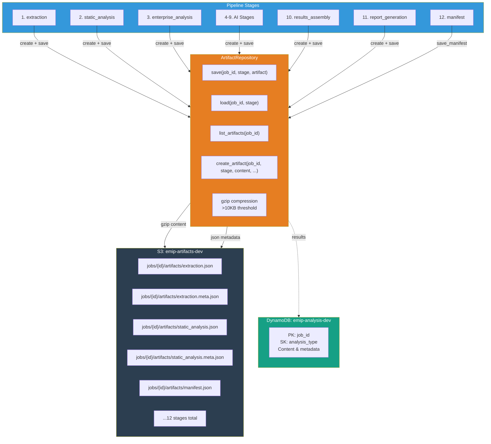
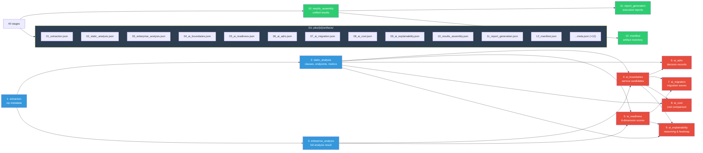
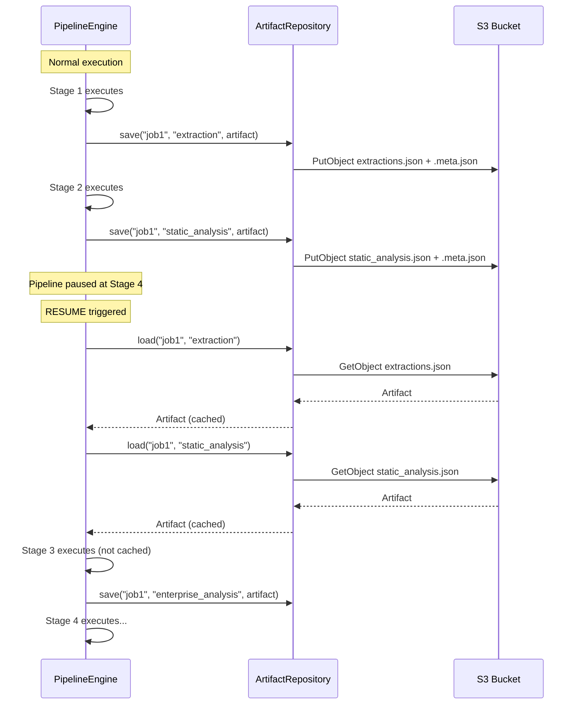

# Artifact System

## Artifact-First Pipeline Design

---

## Overview

Every pipeline stage produces a versioned, compressed `Artifact` stored in S3 with metadata indexed in DynamoDB. This artifact-first design enables checkpoint/resume, traceability, and independent stage execution.

### Key Files

```
backend/app/artifacts/
├── models.py        # Artifact, ArtifactMetadata, ArtifactManifest
├── repository.py    # ArtifactRepository (S3 + compression)
└── version.py       # ArtifactVersioner
```

---

## How It Works



---

## Artifact Storage Flow

Each stage produces one artifact with two S3 objects:

```
S3 Key Structure:
jobs/{job_id}/artifacts/{stage_name}.json          ← Content (may be gzip)
jobs/{job_id}/artifacts/{stage_name}.meta.json      ← Metadata (always JSON)
jobs/{job_id}/artifacts/manifest.json               ← Final manifest
```

### ArtifactRepository

**File:** `backend/app/artifacts/repository.py`

```python
class ArtifactRepository:
    def save(self, job_id, stage_name, artifact) -> str:         # Saves content + metadata
    def load(self, job_id, stage_name) -> Artifact | None:       # Loads artifact
    def load_content(self, job_id, stage_name) -> dict | None:   # Loads only content
    def load_metadata(self, job_id, stage_name) -> ArtifactMetadata | None:
    def artifact_exists(self, job_id, stage_name) -> bool:       # Check exists
    def list_artifacts(self, job_id) -> list[ArtifactMetadata]:  # List all
    def create_artifact(self, job_id, stage_name, content, ...) -> Artifact:  # Creates with auto-metadata
    def save_manifest(self, job_id, manifest) -> str:            # Save manifest
    def load_manifest(self, job_id) -> ArtifactManifest | None:  # Load manifest
```

### Compression

Artifacts larger than 10KB (`COMPRESS_THRESHOLD_BYTES`) are transparently gzip-compressed:

```python
COMPRESS_THRESHOLD_BYTES = 10_240  # 10KB

if len(content_bytes) > COMPRESS_THRESHOLD_BYTES:
    body = gzip.compress(content_bytes)
    content_type = "application/gzip"
else:
    body = content_bytes
    content_type = "application/json"
```

Loading is transparent — compressed artifacts are detected and decompressed automatically:
```python
if content_type == "application/gzip" or raw[:2] == b"\x1f\x8b":
    raw = gzip.decompress(raw)
```

---

## Schema Versioning

**File:** `backend/app/artifacts/version.py:ArtifactVersioner`

```python
class ArtifactVersioner:
    def generate_artifact_id(self) -> str:        # UUID-based unique ID
    def get_artifact_version(self) -> str:        # "1.0.0"
    def get_platform_version(self) -> str:        # "1.0.0"
    def compute_checksum(self, content) -> str:   # SHA-256 hex digest
    def now_iso(self) -> str:                     # ISO 8601 timestamp
```

Every artifact carries:
- `artifact_version: "1.0.0"` — version of the artifact schema
- `analysis_version: "2.0.0"` — version of the analysis format
- `platform_version: "1.0.0"` — version of the platform
- `schema_version: "1.0.0"` — top-level schema version in metadata

**Versioning policy:** When artifact schemas change, the `artifact_version` field is incremented. Backward compatibility is maintained — readers can handle old versions.

---

## Artifact Types and Schemas

### 1. extraction

| Field | Type | Description |
|-------|------|-------------|
| `extracted_path` | string | Temp directory path |
| `zip_key` | string | S3 key of uploaded ZIP |
| `zip_size_bytes` | int | Size of ZIP file |

**Generator:** `sprint4-pipeline`

---

### 2. static_analysis

| Field | Type | Description |
|-------|------|-------------|
| `classes` | array | Parsed Java classes with: name, package, file_path, lines_of_code, method_count, annotations, imports, dependencies, fields, is_entity, is_controller, is_service, is_repository |
| `endpoints` | array | REST endpoints: method, path, handler_class, handler_method, annotations |
| `dependency_edges` | array | Class-to-class dependency pairs |
| `metrics` | object | total_classes, total_methods, total_lines, god_classes[], circular_dependencies[] |
| `package_tree` | object | Hierarchical package structure |

**Generator:** `sprint2-analysis-engine`

---

### 3. enterprise_analysis

| Field | Type | Description |
|-------|------|-------------|
| `project_summary` | object | Project name, version, build system |
| `architecture_summary` | object | Architecture style, modularity score |
| `metrics` | object | Detailed code metrics |
| `quality_metrics` | object | Maintainability, cohesion, coupling |
| `readiness_scores` | object | Overall + per-dimension readiness |
| `readiness_dimensions` | array | 8 readiness dimensions |
| `risk_report` | object | Findings array, summary |
| `dependency_graph` | object | Circular deps, coupling |
| `candidate_services` | array | Detected microservice candidates |
| `bounded_contexts` | array | Domain-driven design contexts |
| `recommendations` | array | Architecture recommendations |
| `confidence_scores` | object | Per-aspect confidence |
| `overall_modernization_score` | number | 0-100 |
| `migration_complexity` | string | low/medium/high/critical |

**Generator:** `sprint2-analysis-engine`

---

### 4. ai_boundaries

| Field | Type | Description |
|-------|------|-------------|
| `services` | array | Service boundary candidates, each with: name, description, cohesion_score, coupling_score, classes[], packages[], api_endpoints[], database_tables[], confidence, readiness (green/yellow/red), risk_level, business_capability |
| `total_services` | int | Count of detected services |
| `business_capabilities` | array | Mapped business capabilities |

**Generator:** `sprint3-ai-layer`

---

### 5. ai_readiness

| Field | Type | Description |
|-------|------|-------------|
| `code_quality` | object | score (0-100), evidence string |
| `architecture` | object | score (0-100), evidence string |
| `cloud_readiness` | object | score (0-100), evidence string |
| `service_separation` | object | score (0-100), evidence string |
| `database_coupling` | object | score (0-100), evidence string |
| `documentation` | object | score (0-100), evidence string |
| `overall` | number | Weighted average (0-100) |
| `confidence` | number | 0.0-1.0 |
| `summary` | string | Readability summary |

**Generator:** `sprint3-ai-layer`

---

### 6. ai_adrs

| Field | Type | Description |
|-------|------|-------------|
| `adrs` | array | Architecture Decision Records, each with: title, context, decision, alternatives (array), tradeoffs (array), consequences (array) |

**Generator:** `sprint3-ai-layer`

---

### 7. ai_migration

| Field | Type | Description |
|-------|------|-------------|
| `waves` | array | Migration waves, each with: wave_number, name, services[], timeline_weeks, estimated_engineers, dependencies[], risk_level, migration_complexity |
| `total_weeks` | int | Estimated total migration duration |
| `recommended_order` | array | Ordered list of wave names |

**Generator:** `sprint3-ai-layer`

---

### 8. ai_cost

| Field | Type | Description |
|-------|------|-------------|
| `current_monthly` | number | Current monthly infrastructure + ops cost |
| `post_migration_monthly` | number | Post-migration monthly cost |
| `monthly_savings` | number | Monthly savings |
| `annual_savings` | number | Annual savings |
| `one_time_cost` | number | One-time migration cost |
| `payback_months` | int | Months to payback |
| `breakdown_current` | object | compute, storage, networking, operations, licensing |
| `breakdown_post` | object | compute, storage, networking, operations, licensing |
| `migration_impact` | object | total_services, total_waves, estimated_timeline_weeks, total_engineers_needed, risk_summary |

**Generator:** `sprint3-ai-layer`

---

### 9. ai_explainability

| Field | Type | Description |
|-------|------|-------------|
| `recommendations` | array | Per-service: service, confidence, primary_reason, secondary_reasons[], evidence (code_isolation, low_coupling, database_independence), migration_complexity |
| `business_capabilities` | array | Detected business capabilities |
| `risk_heatmap` | array | Risk visualization data |

**Generator:** `sprint3-ai-layer`

---

### 10. results_assembly

| Field | Type | Description |
|-------|------|-------------|
| `job_id` | string | UUID |
| `created_at` | string | ISO 8601 |
| `metrics` | object | From static_analysis |
| `service_boundaries` | array | Enriched with class/package/endpoint data |
| `readiness` | object | From ai_readiness |
| `adrs` | array | From ai_adrs |
| `migration_waves` | array | From ai_migration |
| `cost_comparison` | object | From ai_cost |
| `explainability` | object | From ai_explainability |
| `sprint2_analysis` | object | From enterprise_analysis |

**Generator:** `sprint4-pipeline`

---

### 11. report_generation

| Field | Type | Description |
|-------|------|-------------|
| `executive_summary` | object | Structured executive report |
| `developer_report` | object | Technical developer report |
| `financial_analysis` | object | Cost breakdown, savings, ROI |

**Generator:** `sprint4-pipeline`

---

### 12. manifest

| Field | Type | Description |
|-------|------|-------------|
| `schema_version` | string | "1.0.0" |
| `job_id` | string | UUID |
| `project_name` | string | Detected project name |
| `started_at` | string | ISO 8601 |
| `completed_at` | string | ISO 8601 |
| `total_duration_ms` | number | Wall clock time |
| `platform_version` | string | "1.0.0" |
| `analysis_version` | string | "2.0.0" |
| `engine_version` | string | "1.0.0" |
| `artifacts` | array | Metadata for all stage artifacts |
| `reports` | array | Report artifact metadata |
| `pipeline_state` | object | Full pipeline state summary |
| `ai_summary` | object | total_tokens_used, total_cost_estimate, deterministic_fallbacks, degraded_stages[] |
| `checksum` | string | Manifest SHA-256 |

**Generator:** `sprint4-pipeline`

---

## Artifact Flow Diagram



---

## Resume/Checkpoint Flow



**How resume works:**
1. `Executor` receives `resume_from="stage_name"` parameter
2. All stages before `resume_from` are marked as `COMPLETED` and their artifacts loaded from S3
3. The first incomplete stage starts execution normally
4. Subsequent stages save their artifacts as usual

---

## Artifact Versioning Policy

| Scenario | Action |
|----------|--------|
| **New field added** | No version increment (backward compatible) |
| **Field type changed** | Increment `artifact_version` minor (e.g., 1.0.0 → 1.1.0) |
| **Field removed** | Increment `artifact_version` major (e.g., 1.0.0 → 2.0.0) |
| **Schema restructured** | Increment `artifact_version` major |
| **Analysis format changed** | Increment `analysis_version` |
| **Platform release** | Increment `platform_version` |

Current versions:
- `ARTIFACT_SCHEMA_VERSION = "1.0.0"` (in `artifacts/models.py`)
- `analysis_version = "2.0.0"` (Sprint 2 output format)
- `platform_version = "1.0.0"` (Platform release)
- `ENGINE_VERSION = "1.0.0"` (Analysis engine)
