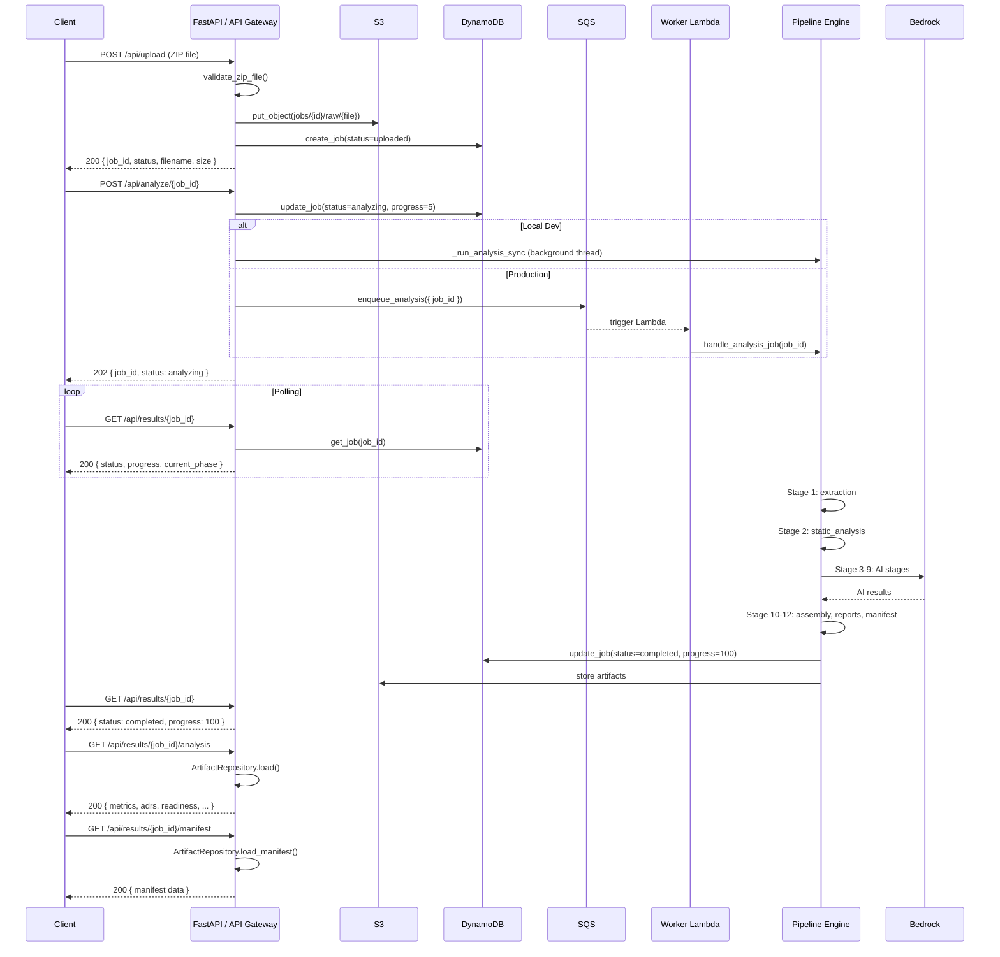

# API Reference — EMIP

## Overview

Base URL: `/api` (proxied in dev via Vite, API Gateway in production)

| Environment | Base URL |
|---|---|
| Local Dev | `http://localhost:5173/api` |
| Dev API Gateway | `https://api.dev.emip.aws/api` |
| Prod API Gateway | `https://api.emip.aws/api` |

## Authentication

All requests require an API key passed via the `X-API-Key` header. Applied globally by `APIKeyMiddleware` in `backend/app/core/security.py`.

```http
X-API-Key: <your-api-key>
```

## Common Headers

| Header | Required | Description |
|---|---|---|
| `Content-Type` | Yes | `application/json` (most endpoints) or `multipart/form-data` (upload) |
| `Accept` | No | `application/json` (default) |
| `X-Request-ID` | No | Client-generated request ID for tracing |
| `X-Correlation-ID` | No | Correlation ID for multi-step flow tracking |

`CorrelationMiddleware` in `backend/app/monitoring/middleware.py` propagates and generates correlation IDs.

## Error Response Format

All errors follow a standard body:

```json
{
  "detail": "Human-readable error message",
  "status_code": 400,
  "error_code": "INVALID_FILE_TYPE"
}
```

Errors are raised via `EMIPException` subclasses defined in `backend/app/exceptions/custom.py` and handled in `backend/app/exceptions/handlers.py`.

| HTTP Status | Meaning |
|---|---|
| 400 | Bad request (invalid file type, empty ZIP, invalid state transition) |
| 404 | Resource not found (job, artifact, service) |
| 422 | Validation failed (malformed input, invalid schema) |
| 500 | Internal server error |

---

## Endpoints

### POST `/api/upload`

Upload a Java project ZIP file. Validates file type and structure, stores in S3, creates a DynamoDB job record.

**Request:** `multipart/form-data`

| Field | Type | Required |
|---|---|---|
| `file` | File (`.zip`) | Yes |

**Response `200`:**

```json
{
  "job_id": "a1b2c3d4-e5f6-7890-abcd-ef1234567890",
  "status": "uploaded",
  "filename": "my-project.zip",
  "file_size": 1048576,
  "progress": 0,
  "created_at": "2026-07-30T12:00:00Z",
  "updated_at": "2026-07-30T12:00:00Z"
}
```

**Errors:**

| Code | Condition |
|---|---|
| `400` | Invalid file extension (not `.zip`), empty ZIP, corrupt archive |
| `422` | Project validation failed (missing expected structure) |

**Implementation:** `backend/app/routes/upload.py` — `upload_codebase` → `ZIPValidator` in `backend/app/validators/zip_validator.py` → `S3Repository.put_object` → `JobRepository.create_job`.

```bash
curl -X POST http://localhost:8000/api/upload \
  -H "X-API-Key: dev-key" \
  -F "file=@my-project.zip"
```

---

### POST `/api/analyze/{job_id}`

Trigger analysis pipeline for an uploaded job. Runs synchronously in a background thread in local dev, or enqueues to SQS in production.

**Request:** Query parameters

| Param | Type | Default | Description |
|---|---|---|---|
| `resume` | bool | `false` | Resume from last checkpoint |
| `profile` | string | `normal` | Analysis profile: `fast`, `normal`, `deep`, `benchmark` |

> Note: The current route signature uses the `resume` boolean with `CheckpointManager` for resumption. Profile selection is read from settings via `AnalysisProfile` in `backend/app/core/analysis_profile.py`.

**Response `202`:**

```json
{
  "job_id": "a1b2c3d4-e5f6-7890-abcd-ef1234567890",
  "status": "analyzing",
  "progress": 5,
  "current_phase": "upload",
  "message": "Analysis started"
}
```

**Errors:**

| Code | Condition |
|---|---|
| `400` | Job in invalid state (not `uploaded`/`failed`/`paused`) |
| `404` | Job ID not found |
| `422` | Invalid job ID format |

**Implementation:** `backend/app/routes/analyze.py:start_analysis` → `CheckpointManager` → either local `threading.Thread` or `SQSRepository.enqueue_analysis`.

```bash
curl -X POST http://localhost:8000/api/analyze/a1b2c3d4-e5f6-7890-abcd-ef1234567890 \
  -H "X-API-Key: dev-key"
```

---

### GET `/api/jobs`

List all jobs, sorted by `created_at` descending.

**Response `200`:**

```json
{
  "jobs": [
    {
      "job_id": "a1b2c3d4-e5f6-7890-abcd-ef1234567890",
      "status": "completed",
      "filename": "my-project.zip",
      "file_size": 1048576,
      "progress": 100,
      "created_at": "2026-07-30T12:00:00Z",
      "updated_at": "2026-07-30T12:30:00Z"
    }
  ]
}
```

**Implementation:** `backend/app/routes/results.py:list_jobs` → `JobRepository.list_jobs` → DynamoDB `scan`.

```bash
curl http://localhost:8000/api/jobs \
  -H "X-API-Key: dev-key"
```

---

### GET `/api/results/{job_id}`

Get job status, progress, and metadata.

**Response `200`:**

```json
{
  "job_id": "a1b2c3d4-e5f6-7890-abcd-ef1234567890",
  "status": "completed",
  "filename": "my-project.zip",
  "file_size": 1048576,
  "progress": 100,
  "current_phase": "manifest",
  "completed_phases": ["extraction", "static_analysis", "enterprise_analysis", "ai_boundaries", "ai_readiness", "ai_adrs", "ai_migration", "ai_cost", "ai_explainability", "results_assembly", "report_generation", "manifest"],
  "error": null,
  "created_at": "2026-07-30T12:00:00Z",
  "updated_at": "2026-07-30T12:30:00Z",
  "is_degraded": false,
  "degraded_stages": []
}
```

**Errors:**

| Code | Condition |
|---|---|
| `404` | Job ID not found |

```bash
curl http://localhost:8000/api/results/a1b2c3d4-e5f6-7890-abcd-ef1234567890 \
  -H "X-API-Key: dev-key"
```

---

### GET `/api/results/{job_id}/analysis`

Get full analysis results (metrics, service boundaries, readiness scores, ADRs, migration waves, cost comparison, explainability).

**Response `200`:**

```json
{
  "metrics": { ... },
  "service_boundaries": [ ... ],
  "readiness": { ... },
  "adrs": [ ... ],
  "migration_waves": [ ... ],
  "cost_comparison": { ... },
  "explainability": { ... }
}
```

**Implementation:** `backend/app/routes/results.py:get_analysis_results` → `ArtifactRepository.load` (primary) → `S3Repository.get_object` (fallback).

```bash
curl http://localhost:8000/api/results/a1b2c3d4-e5f6-7890-abcd-ef1234567890/analysis \
  -H "X-API-Key: dev-key"
```

---

### GET `/api/results/{job_id}/artifacts`

List all artifacts generated for a job.

**Response `200`:**

```json
{
  "artifacts": [
    {
      "artifact_name": "static_analysis",
      "artifact_type": "analysis",
      "created_at": "2026-07-30T12:05:00Z",
      "schema_version": 2,
      "size": 45000
    }
  ],
  "count": 1
}
```

**Errors:**

| Code | Condition |
|---|---|
| `404` | Job ID not found |

**Implementation:** `backend/app/routes/results.py:list_artifacts` → `ArtifactRepository.list_artifacts`.

```bash
curl http://localhost:8000/api/results/a1b2c3d4-e5f6-7890-abcd-ef1234567890/artifacts \
  -H "X-API-Key: dev-key"
```

---

### GET `/api/results/{job_id}/manifest`

Get the deployment manifest for a completed job. The manifest contains metadata about all stages, artifacts, and deployment targets.

**Response `200`:**

```json
{
  "job_id": "a1b2c3d4-e5f6-7890-abcd-ef1234567890",
  "pipeline_version": "2.0.0",
  "stages": [
    { "name": "extraction", "status": "completed", "duration_ms": 1200 }
  ],
  "artifacts": [ ... ],
  "generated_at": "2026-07-30T12:30:00Z"
}
```

**Errors:**

| Code | Condition |
|---|---|
| `404` | Manifest not found for job ID |

**Implementation:** `backend/app/routes/results.py:get_manifest` → `ArtifactRepository.load_manifest`.

```bash
curl http://localhost:8000/api/results/a1b2c3d4-e5f6-7890-abcd-ef1234567890/manifest \
  -H "X-API-Key: dev-key"
```

---

### POST `/api/jobs/{job_id}/pause`

Pause a running analysis. Only valid when status is `analyzing`.

**Response `200`:**

```json
{
  "job_id": "a1b2c3d4-e5f6-7890-abcd-ef1234567890",
  "status": "paused",
  "current_phase": "pausing"
}
```

**Implementation:** `backend/app/routes/jobs.py:pause_job` → `JobRepository.update_job`.

```bash
curl -X POST http://localhost:8000/api/jobs/a1b2c3d4-e5f6-7890-abcd-ef1234567890/pause \
  -H "X-API-Key: dev-key"
```

---

### POST `/api/jobs/{job_id}/resume`

Resume a paused analysis from the last checkpoint.

**Response `200`:**

```json
{
  "job_id": "a1b2c3d4-e5f6-7890-abcd-ef1234567890",
  "status": "uploaded",
  "current_phase": "resuming"
}
```

**Implementation:** `backend/app/routes/jobs.py:resume_job` → `JobRepository.update_job`.

```bash
curl -X POST http://localhost:8000/api/jobs/a1b2c3d4-e5f6-7890-abcd-ef1234567890/resume \
  -H "X-API-Key: dev-key"
```

---

### POST `/api/jobs/{job_id}/cancel`

Cancel a running or paused job permanently.

**Response `200`:**

```json
{
  "job_id": "a1b2c3d4-e5f6-7890-abcd-ef1234567890",
  "status": "cancelled",
  "current_phase": "cancelled"
}
```

```bash
curl -X POST http://localhost:8000/api/jobs/a1b2c3d4-e5f6-7890-abcd-ef1234567890/cancel \
  -H "X-API-Key: dev-key"
```

---

### DELETE `/api/jobs/{job_id}`

Permanently delete a job and all associated data (DynamoDB record + S3 objects + artifacts).

**Response `200`:**

```json
{
  "status": "deleted",
  "job_id": "a1b2c3d4-e5f6-7890-abcd-ef1234567890"
}
```

**Implementation:** `backend/app/routes/jobs.py:delete_job` → `S3Repository.delete_prefix` + `JobRepository.delete_job`.

```bash
curl -X DELETE http://localhost:8000/api/jobs/a1b2c3d4-e5f6-7890-abcd-ef1234567890 \
  -H "X-API-Key: dev-key"
```

---

### GET `/api/capabilities`

List registered platform capabilities across all categories.

**Response `200`:**

```json
{
  "capabilities": [
    { "name": "static_analysis", "category": "analysis", "enabled": true, "description": "Regex-based Java static analysis" }
  ]
}
```

**Implementation:** `backend/app/routes/results.py:list_capabilities` → `CapabilityRegistry` in `backend/app/capabilities/registry.py`.

```bash
curl http://localhost:8000/api/capabilities \
  -H "X-API-Key: dev-key"
```

---

### GET `/api/health`

Detailed health check that verifies AWS connectivity via STS.

**Response `200`:**

```json
{
  "status": "healthy",
  "version": "2.0.0",
  "aws_connected": true,
  "environment": "dev"
}
```

**Implementation:** `backend/app/main.py:api_health` → `AWSClients.sts.get_caller_identity()`.

```bash
curl http://localhost:8000/api/health
```

---

### GET `/health`

Simple health check (no AWS dependency).

**Response `200`:**

```json
{
  "status": "healthy",
  "version": "2.0.0"
}
```

```bash
curl http://localhost:8000/health
```

---

### POST `/api/deploy`

Generate microservice code for a detected service boundary using Bedrock.

**Request:**

```json
{
  "job_id": "a1b2c3d4-e5f6-7890-abcd-ef1234567890",
  "service_name": "OrderService"
}
```

**Response `200`:**

```json
{
  "deployment_id": "d-1234",
  "status": "code_generated",
  "service_name": "OrderService",
  "ecs_cluster": null,
  "ecs_service": null,
  "alb_dns": null,
  "health_check_url": null
}
```

**Implementation:** `backend/app/routes/deploy.py:deploy_service` → `bedrock_analyzer.generate_service_code` → S3 storage. Infrastructure fields (`ecs_cluster`, etc.) are placeholders for Sprint 9.

```bash
curl -X POST http://localhost:8000/api/deploy \
  -H "X-API-Key: dev-key" \
  -H "Content-Type: application/json" \
  -d '{"job_id": "a1b2c3d4-e5f6-7890-abcd-ef1234567890", "service_name": "OrderService"}'
```

---

## Full Flow Sequence



## Job Status Lifecycle

```
uploaded → queued → analyzing → completed
                    ↓
                 paused → resumed → uploaded
                    ↓
               cancelled
                    ↓
                failed
```

Status values are defined in `JobStatus` enum in `backend/app/models/schemas.py`. Valid transitions are enforced in routes.

## Frontend API Client

The frontend consumes these endpoints via `frontend/src/services/jobService.ts`, which wraps an Axios instance configured in `frontend/src/services/api.ts`:

```typescript
// frontend/src/services/api.ts — Axios instance with base URL and API key
const api = axios.create({
  baseURL: API_BASE,
  timeout: 300000,
  headers: apiKey ? { 'X-API-Key': apiKey } : {},
});
```
