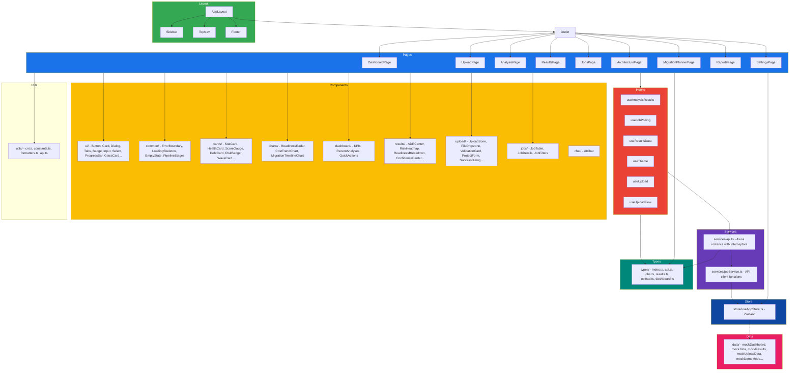

# Frontend Architecture — EMIP

## Tech Stack

| Layer | Technology | Version |
|---|---|---|
| Build tool | Vite | 5.x |
| Framework | React | 18.x |
| Language | TypeScript | 5.x |
| Styling | Tailwind CSS | 3.x |
| Routing | React Router | 6.x |
| Server state | TanStack React Query | Latest |
| UI state | Zustand | 4.x |
| Charts | Recharts | 2.x |
| Graphs | ReactFlow | 11.x |
| Animations | Framer Motion | 11.x |
| Icons | lucide-react | Latest |
| Command palette | cmdk | Latest |
| Toasts | sonner | Latest |

## Architecture



## Pages

### DashboardPage (`frontend/src/pages/DashboardPage.tsx`)

Overview page with KPIs, recent analyses, and quick actions. Uses mock data in demo mode from `frontend/src/data/mockDashboard.ts`.

**Sections:**
- KPI cards (total analyses, success rate, migration readiness, risk score)
- Recent analyses table
- Quick action buttons (upload, view jobs, reports)

### UploadPage (`frontend/src/pages/UploadPage.tsx`)

Multi-step upload flow orchestrated by `useUploadFlow` hook.

**Steps:** Form → Validate → Upload → Success

**Components used:**
- `FileDropzone` — drag-and-drop ZIP file selection
- `UploadZone` — upload target area
- `ProjectForm` — project metadata input
- `ValidationCard` — validation results display
- `UploadProgress` / `UploadProgressCard` — upload progress bars
- `SuccessDialog` — completion confirmation
- `ErrorBanner` — error display
- `WorkflowTimeline` — step progress indicator
- `HistoryTable` — previous uploads

### AnalysisPage (`frontend/src/pages/AnalysisPage.tsx`)

Real-time pipeline progress visualization using `useJobPolling` hook.

Displays:
- Job status badge
- Progress bar
- Pipeline stage timeline (all 12 stages with status indicators)
- Current phase description
- Cancel / pause controls

### ResultsPage (`frontend/src/pages/ResultsPage.tsx`)

Full analysis results display using `useResultsData` and `useAnalysisResults` hooks.

**Components used:**
- `ExecutiveSummary` — high-level overview with modernization score
- `ADRCenter` — Architecture Decision Records
- `ArchitectureIntelligence` — AI-generated architecture insights
- `BusinessCapabilityMap` — business capability mapping
- `MicroserviceRecommendations` — service boundary recommendations
- `MigrationRoadmap` — migration wave timeline
- `CostAndROI` — cost comparison and ROI analysis
- `ReadinessBreakdown` — readiness scores by dimension
- `RiskHeatmap` — risk findings visualization
- `ConfidenceCenter` — AI confidence scores per area
- `TechnicalDebtCenter` — technical debt analysis
- `ExplainabilityCenter` — AI decision traceability
- `ValidationSummary` — overall validation status
- `ExportCenter` — export/PDF generation
- `GeneratedArtifacts` — list of generated artifacts

### JobsPage (`frontend/src/pages/JobsPage.tsx`)

Job history and active job management.

**Features:**
- Job table with status badges, progress bars, timestamps
- Filter by status (all, active, completed, failed)
- Drawer with job details on row click
- Actions: pause, resume, cancel, delete, view results

### ArchitecturePage (`frontend/src/pages/ArchitecturePage.tsx`)

Interactive ReactFlow dependency graph visualization of the analyzed codebase.

**Features:**
- Force-directed graph layout
- Zoom and pan
- Node selection for detailed view
- Edge filtering
- Service boundary highlighting

### MigrationPlannerPage (`frontend/src/pages/MigrationPlannerPage.tsx`)

Migration waves timeline and detailed breakdown using `WaveCard` components and `MigrationTimelineChart`.

**Features:**
- Wave timeline visualization
- Per-wave service assignments
- Risk and complexity indicators
- Dependency tracking between waves

### ReportsPage (`frontend/src/pages/ReportsPage.tsx`)

Generated report management and export.

**Features:**
- Report list with type indicators
- Export to PDF/JSON
- Report preview
- Scheduled report configuration

### SettingsPage (`frontend/src/pages/SettingsPage.tsx`)

User configuration and preferences.

**Features:**
- Theme selection (light/dark/system)
- Demo mode toggle
- API endpoint configuration
- Analysis profile defaults

## Component Inventory (~95+ components)

### `ui/` — Reusable primitives
`Button`, `Card`, `GlassCard`, `Badge`, `StatusBadge`, `Dialog`, `Tabs`, `Input`, `Select`, `ProgressBar`, `Tooltip`, `Breadcrumb`, `SectionHeader`, `ReusableTable`, `DemoModeToggle`

### `layout/` — Application shell
`Sidebar` (nav menu, collapse toggle), `TopNav` (breadcrumbs, demo indicator, theme toggle), `Footer`

### `common/` — Cross-cutting
`ErrorBoundary`, `LoadingSkeleton`, `EmptyState`, `PipelineStages`

### `cards/` — Data display cards
`StatCard`, `HealthCard`, `ScoreGauge`, `DebtCard`, `RiskBadge`, `CostBreakdownCard`, `WaveCard`, `ExplainabilityCard`

### `charts/` — Data visualizations
`ReadinessRadar`, `CostTrendChart`, `MigrationTimelineChart`

### `dashboard/` — Dashboard-specific
KPIs, RecentAnalyses, QuickActions

### `results/` — Results page sections
`ExecutiveSummary`, `ADRCenter`, `ArchitectureIntelligence`, `BusinessCapabilityMap`, `MicroserviceRecommendations`, `MigrationRoadmap`, `CostAndROI`, `ReadinessBreakdown`, `RiskHeatmap`, `ConfidenceCenter`, `TechnicalDebtCenter`, `ExplainabilityCenter`, `ValidationSummary`, `ExportCenter`, `GeneratedArtifacts`

### `upload/` — Upload flow
`UploadZone`, `FileDropzone`, `ProjectForm`, `ValidationCard`, `UploadProgress`, `UploadProgressCard`, `SuccessDialog`, `ErrorBanner`, `WorkflowTimeline`, `HistoryTable`, `FrameworkCard`

### `jobs/` — Jobs page
`JobTable`, `JobDetails`, `JobFilters`

### `chat/` — AI assistant
`AIChat` — floating chat panel for querying analysis results

## State Management

### Zustand Store (`frontend/src/store/useAppStore.ts`)

```typescript
interface AppState {
  sidebarCollapsed: boolean;
  toggleSidebar: () => void;
  theme: 'light' | 'dark' | 'system';
  setTheme: (theme: 'light' | 'dark' | 'system') => void;
  demoMode: boolean;
  toggleDemoMode: () => void;
}
```

Persistence is handled via `localStorage` keys: `emip-sidebar`, `emip-theme`, `emip-demo`.

### TanStack React Query

Used for server state (job data, analysis results, artifacts) with automatic caching, refetching, and background updates. The polling loop for analysis progress uses configurable `refetchInterval`.

## API Client

### `frontend/src/services/api.ts`

Axios instance:

```typescript
const api = axios.create({
  baseURL: API_BASE,
  timeout: 300000,          // 5 minutes for long-running uploads
  headers: apiKey ? { 'X-API-Key': apiKey } : {},
});
```

Response interceptor extracts error message from `error.response?.data?.detail`.

### `frontend/src/services/jobService.ts`

Typed API client functions:
- `uploadCodebase(file)` → POST `/upload`
- `startAnalysis(jobId)` → POST `/analyze/{jobId}`
- `getJobStatus(jobId)` → GET `/results/{jobId}`
- `getAnalysisResults(jobId)` → GET `/results/{jobId}/analysis`
- `listJobs()` → GET `/jobs`
- `pauseJob(jobId)` → POST `/jobs/{jobId}/pause`
- `resumeJob(jobId)` → POST `/jobs/{jobId}/resume`
- `cancelJob(jobId)` → POST `/jobs/{jobId}/cancel`
- `deleteJob(jobId)` → DELETE `/jobs/{jobId}`
- `deployService(jobId, serviceName)` → POST `/deploy`

## Demo Mode

When `useAppStore().demoMode` is `true`, pages substitute real API calls with mock data from `frontend/src/data/`:

| Data File | Contents |
|---|---|
| `mockDashboard.ts` | KPI cards, recent analyses |
| `mockJobs.ts` | Job list with varied statuses |
| `mockResults.ts` | Full analysis results |
| `mockUploadData.ts` | Upload progress simulation |
| `mockDemoMode.ts` | Demo flow configuration |
| `mockExplainability.ts` | AI explainability data |
| `mockCapabilities.ts` | Platform capabilities |

## Routing

```mermaid
graph LR
    ROOT[/] --> DASH[/]
    ROOT --> UPLOAD[/upload]
    ROOT --> ANALYZE[/analysis/:jobId]
    ROOT --> RESULTS[/results/:jobId]
    ROOT --> JOBS[/jobs]
    ROOT --> ARCH[/architecture/:jobId]
    ROOT --> MIG[/migration-planner/:jobId]
    ROOT --> REPORTS[/reports]
    ROOT --> SETTINGS[/settings]
```

All routes are nested inside `AppLayout` (`frontend/src/layouts/AppLayout.tsx`) which provides Sidebar + TopNav + Outlet + Footer + AIChat.

## Styling Approach

- **Tailwind CSS** with CSS custom properties for theming
- **Dark/light theme** toggled via `<html class="dark">` and `useTheme` hook
- **Glassmorphism effects** using `backdrop-blur` and semi-transparent backgrounds via `GlassCard` component
- **Responsive design** with collapsible sidebar
- CSS variables defined in `:root` and `.dark` selectors for colors, backgrounds, and borders

## Key Hooks

| Hook | File | Purpose |
|---|---|---|
| `useTheme` | `frontend/src/hooks/useTheme.ts` | Applies theme class to `<html>` element |
| `useUpload` | `frontend/src/hooks/useUpload.ts` | File upload with progress tracking |
| `useUploadFlow` | `frontend/src/hooks/useUploadFlow.ts` | Multi-step upload state machine |
| `useJobPolling` | `frontend/src/hooks/useJobPolling.ts` | Polls `/results/{jobId}` until terminal state |
| `useAnalysisResults` | `frontend/src/hooks/useAnalysisResults.ts` | Fetches analysis results from `/analysis` endpoint |
| `useResultsData` | `frontend/src/hooks/useResultsData.ts` | Aggregated results data hook |
