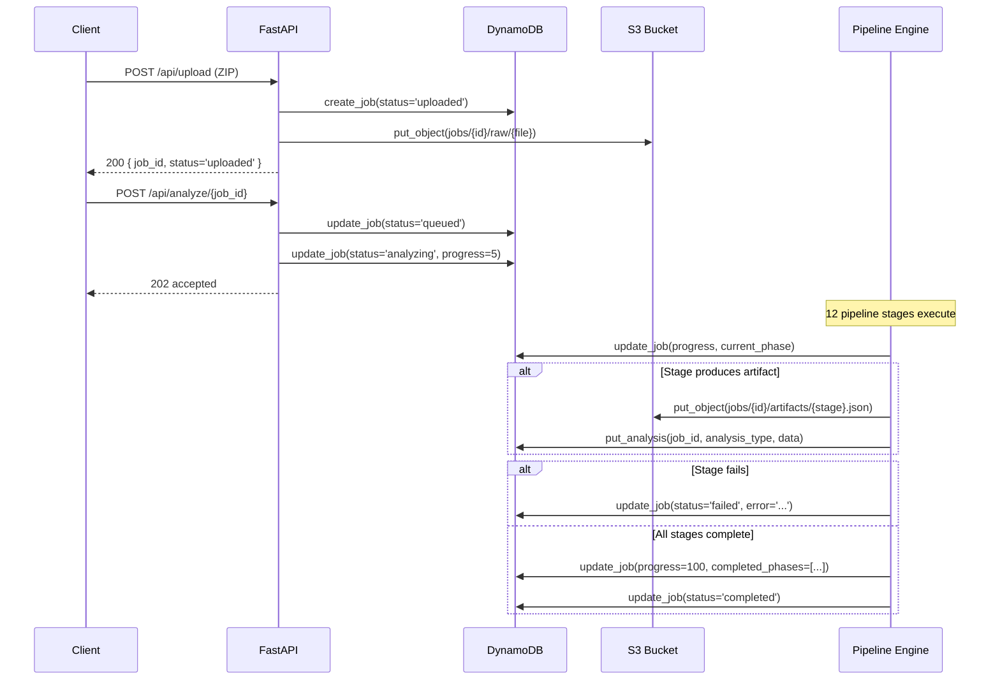

# Database — EMIP

## Overview

EMIP uses Amazon DynamoDB as its primary data store. Two tables store job metadata and analysis results respectively. Tables are suffixed by environment (`-dev`, `-prod`).

## DynamoDB Tables

### `emip-jobs-{env}` — Job Metadata

Stores per-job status, progress, and metadata. Each row represents a single uploaded project.

| Attribute | Type | Required | Description |
|---|---|---|---|
| `job_id` | String (PK) | Yes | UUID v4, generated by `uuid_provider` |
| `status` | String | Yes | One of: `uploaded`, `queued`, `analyzing`, `paused`, `completed`, `failed`, `cancelled` |
| `filename` | String | Yes | Original uploaded ZIP filename |
| `file_size` | Number | Yes | File size in bytes |
| `created_at` | String (ISO 8601) | Yes | Timestamp of job creation |
| `updated_at` | String (ISO 8601) | Yes | Timestamp of last update |
| `progress` | Number | No | 0–100, percentage complete |
| `current_phase` | String | No | Current pipeline stage name |
| `error` | String | No | Error message if failed |
| `analysis_profile` | String | No | Profile used: `fast`, `normal`, `deep`, `benchmark` |
| `metadata` | Map | No | Flexible metadata for future attributes |
| `checkpoint_phase` | String | No | Phase to resume from (Sprint 4) |
| `retry_count` | Number | No | Number of retry attempts |
| `worker_id` | String | No | Worker Lambda identifier |
| `event_id` | String | No | SQS event ID |
| `is_degraded` | Boolean | No | Whether any stages fell back to deterministic |
| `degraded_stages` | List | No | Names of stages that used fallback |
| `completed_phases` | List | No | Ordered list of completed phase names |

**Access patterns (no GSI):**

The Jobs table is keyed on `job_id` only. `get_job`/`update_job` use the primary key; `list_jobs` runs a full Scan and sorts on `created_at` in memory. There is **no** `status-created_at-index` GSI in `infrastructure/template.yaml` — the `status` field is a regular attribute, and status-filtered listing is done client-side.

**Status State Machine:**

```
uploaded → queued → analyzing → completed
                    ↓
                 paused → uploaded (resumed)
                    ↓
               cancelled
               failed (from any active state)
```

**Domain Model:** `JobDomain` in `backend/app/models/job.py`

```python
@dataclass
class JobDomain:
    job_id: str
    status: str
    filename: str
    file_size: int = 0
    created_at: str = ...
    updated_at: str = ...
    progress: int = 0
    current_phase: str | None = None
    error: str | None = None
    checkpoint_phase: str | None = None
    retry_count: int = 0
    worker_id: str | None = None
    event_id: str | None = None
    is_degraded: bool = False
    degraded_stages: list[str] = field(default_factory=list)
    completed_phases: list[str] = field(default_factory=list)
```

---

### `emip-analysis-{env}` — Analysis Results

Stores per-type analysis results for each job. One record per analysis type per job.

| Attribute | Type | Required | Description |
|---|---|---|---|
| `job_id` | String (PK) | Yes | UUID v4, same as jobs table |
| `analysis_type` | String (SK) | Yes | Analysis type identifier (e.g., `full`, `static_analysis`, `ai_boundaries`) |
| `data` | Map | Yes | Analysis result payload |
| `artifact_paths` | List | No | S3 paths to generated artifacts |
| `created_at` | String (ISO 8601) | Yes | Timestamp of analysis creation |
| `schema_version` | Number | No | Artifact schema version for migration support |
| `metadata` | Map | No | Flexible metadata for future attributes |

**Domain Model:** `AnalysisDomain` in `backend/app/models/analysis.py`

```python
@dataclass
class AnalysisDomain:
    job_id: str
    metrics: dict = field(default_factory=dict)
    service_boundaries: list = field(default_factory=list)
    readiness: dict = field(default_factory=dict)
    adrs: list = field(default_factory=list)
    migration_waves: list = field(default_factory=list)
    cost_comparison: dict = field(default_factory=dict)
    explainability: dict = field(default_factory=dict)
    created_at: str = ...
```

---

## Data Flow



## Indexes

| Table | Index | Type | Key(s) | Purpose |
|---|---|---|---|---|
| `emip-jobs-{env}` | (none) | — | PK: `job_id` | Lookup/update by id; `list_jobs` uses a Scan + in-memory sort |
| `emip-analysis-{env}` | (none) | — | PK: `job_id`, SK: `analysis_type` | Query all analysis types for a job |

## Capacity

**PAY_PER_REQUEST (on-demand)** for both tables.

No provisioned capacity — EMIP workloads are bursty and unpredictable (interactive analysis sessions). On-demand auto-scales to handle concurrent analyses without throttling.

## Point-in-Time Recovery (PITR)

Enabled on both tables. Allows restoration to any point within the last 35 days. Useful for recovering accidentally deleted jobs or analysis data.

## Access Patterns

All database operations go through repository classes in `backend/app/aws/dynamodb.py`.

### `JobRepository`

| Method | Operation | Description |
|---|---|---|
| `create_job(job_id, filename, file_size, status)` | `PutItem` | Create a new job record |
| `get_job(job_id)` | `GetItem` | Fetch a single job by PK |
| `update_job(job_id, status, progress, ...)` | `UpdateItem` | Partial update with expression |
| `list_jobs()` | `Scan` | List all jobs sorted by `created_at DESC` |
| `delete_job(job_id)` | `DeleteItem` | Remove a job record |

### `AnalysisRepository`

| Method | Operation | Description |
|---|---|---|
| `put_analysis(job_id, analysis_type, data)` | `PutItem` | Store analysis results |
| `get_analysis(job_id, analysis_type)` | `GetItem` | Retrieve analysis results |

## Repository Implementation

```python
# backend/app/aws/dynamodb.py
class JobRepository:
    def __init__(self):
        settings = get_settings()
        self._clients = AWSClients(settings=settings)
        self._table = self._clients.dynamodb.Table(settings.dynamodb_jobs_table)

    def create_job(self, job_id, filename, file_size, status):
        now = datetime.now(timezone.utc).isoformat()
        job = JobDomain(job_id=job_id, status=status, filename=filename,
                        file_size=file_size, created_at=now, updated_at=now)
        self.table.put_item(Item=job.to_dict())
        return job

    def update_job(self, job_id, status=None, progress=None,
                   current_phase=None, error=None, completed_phases=None):
        updates = {"updated_at": datetime.now(timezone.utc).isoformat()}
        if status is not None:       updates["status"] = status
        if progress is not None:     updates["progress"] = progress
        if current_phase is not None: updates["current_phase"] = current_phase
        if error is not None:        updates["error"] = error
        if completed_phases is not None: updates["completed_phases"] = completed_phases
        # Builds UpdateExpression dynamically with ExpressionAttributeValues
        self.table.update_item(...)
```

## S3 Object Layout

In addition to DynamoDB, analysis artifacts are stored in S3:

```
s3://emip-artifacts-{env}/
  jobs/{job_id}/
    raw/{filename}                    ← Uploaded ZIP
    analysis/results.json             ← Legacy analysis results
    analysis/static_analysis.json     ← Static analysis output
    analysis/manifest.json            ← Pipeline manifest
    artifacts/{stage_name}.json       ← Per-stage artifacts (Sprint 4)
    checkpoints/{stage_name}.json     ← Checkpoint state (Sprint 4)
    deployments/{deploy_id}/code.json ← Generated service code (Sprint 9)
```

**Repository:** `S3Repository` in `backend/app/aws/s3.py`
**Artifact Repository:** `ArtifactRepository` in `backend/app/artifacts/repository.py` (versioned artifacts with schema migration)
