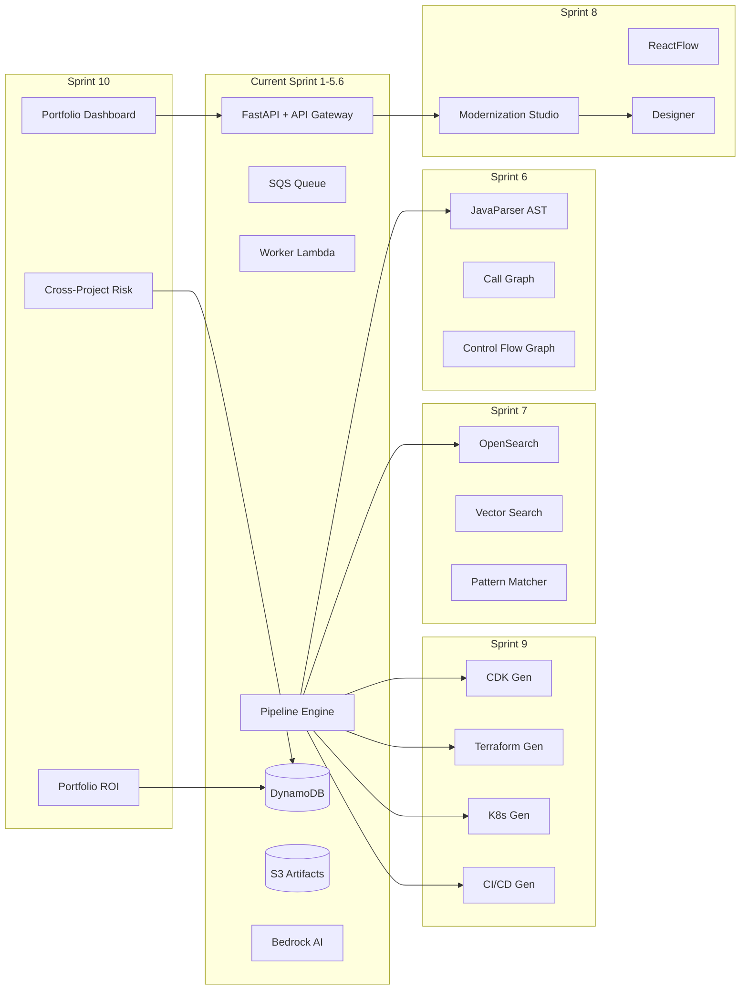

# Remaining Roadmap — EMIP

## Current Completion Status

| Area | Completion | Notes |
|---|---|---|
| API Endpoints | 100% | All 13 endpoints implemented and validated |
| Pipeline Engine | 100% | 12 stages with DAG-based parallel execution |
| AI Integration | 100% | Nova (Pro/Lite/Micro) providers, deterministic fallback chain, guardrails |
| Analysis Profiles | 100% | FAST/NORMAL/DEEP/BENCHMARK modes |
| Frontend Pages | 80% | 9 pages built; some lack full API integration |
| Frontend Components | 85% | ~95 components built; some refinement needed |
| Infrastructure (AWS) | 90% | SAM/CDK templates; minor refinements pending |
| Monitoring | 80% | Logging and X-Ray in place; dashboards needed |
| CI/CD | 20% | Basic CI structure; no deployment pipeline |
| Documentation | 70% | Architecture/API/design docs complete |
| **Overall** | **85%** | |

---

## Sprint 6 — Advanced Static Analysis

**Status:** Planned
**Goal:** Replace regex-based analysis with JavaParser AST for accurate, deep code understanding.

### Tasks

| # | Task | Description | Acceptance Criteria |
|---|---|---|---|
| 6.1 | AST Parsing | Integrate JavaParser to produce full AST for Java source files | All Java files parsed; AST stored in artifact repository |
| 6.2 | Call Graph Construction | Build call graph from method invocations | Directed graph with entry points, callers, callees |
| 6.3 | Control Flow Graph | Generate CFG for each method | Basic blocks, branches, loops; complexity metrics |
| 6.4 | Data Flow Analysis | Track variable definitions and usages | Reaching definitions, live variables, taint propagation |
| 6.5 | Enhanced Dependency Graph | Replace regex-based dependency detection with AST-aware analysis | Accurate class-level dependencies; package-level aggregation |
| 6.6 | Bytecode Analysis | Fallback when source unavailable | Decompilation or bytecode-level dependency extraction |
| 6.7 | Architectural Rule Engine | Enforce custom architecture rules (layering, package cycles) | Configurable rules in YAML; violation reports |
| 6.8 | Duplicate Detection | AST-based clone detection (Type 1, 2, 3) | Clone pairs with similarity scores |
| 6.9 | Enhanced Dead Code Detection | Unused methods, fields, classes with call graph | Dead code report with call graph paths |
| 6.10 | Complexity Metrics | McCabe cyclomatic complexity, LCOM, afferent/efferent coupling | Per-class and per-package metrics |

**Files to modify:**
- `backend/app/analysis/parser/java_parser.py` — Rewrite with JavaParser
- `backend/app/analysis/dependency/graph.py` — Enhance with AST data
- `backend/app/analysis/metrics/code_metrics.py` — Add complexity metrics
- `backend/app/analysis/rules/*.py` — Enhance rule engine
- `backend/app/services/static_analyzer.py` — Deprecate or refactor

---

## Sprint 7 — Enterprise Knowledge Base

**Status:** Planned
**Goal:** RAG-based knowledge retrieval for informed migration recommendations.

### Tasks

| # | Task | Description | Acceptance Criteria |
|---|---|---|---|
| 7.1 | OpenSearch Integration | Managed OpenSearch cluster with indexed project data | Documents indexed; searchable via API |
| 7.2 | Vector Search | Embedding-based semantic search on code patterns | Similar code search; pattern recommendations |
| 7.3 | AWS Well-Architected Framework | Framework rules encoded as searchable documents | WA Framework questions answered per project |
| 7.4 | Reference Architecture Library | Common migration patterns stored and retrievable | Pattern matching against project characteristics |
| 7.5 | Pattern Matching Engine | Match project patterns against reference architectures | Accuracy metrics; suggestions ranked by confidence |
| 7.6 | Historical Tracking | Track analysis history across multiple runs | Delta reports; trend analysis |

**New dependencies:**
- `opensearch-py` — OpenSearch client
- `sentence-transformers` or Bedrock embeddings — Embedding generation

---

## Sprint 8 — Modernization Studio

**Status:** Planned
**Goal:** Interactive architecture canvas with drag-and-drop service design.

### Tasks

| # | Task | Description | Acceptance Criteria |
|---|---|---|---|
| 8.1 | Dependency Visualization | Enhanced ReactFlow graph with zoom, filter, search | Interactive graph with node/edge filtering |
| 8.2 | Microservice Designer | Drag-and-drop service boundary creation | Users can create/edit service boundaries visually |
| 8.3 | Drag-Drop Service Boundaries | Move classes between service boundaries | Real-time dependency impact analysis |
| 8.4 | Migration Simulation | Simulate migration with cost/time estimates | "What-if" scenarios; before/after comparison |
| 8.5 | Architecture Editing | Edit architecture metadata, rename services | Persisted changes; version history |

**Files to modify:**
- `frontend/src/pages/ArchitecturePage.tsx` — Enhanced ReactFlow
- `frontend/src/components/results/MicroserviceRecommendations.tsx` — Designer integration
- `backend/app/routes/` — New endpoints for saving architecture edits

---

## Sprint 9 — Deployment Automation

**Status:** Planned
**Goal:** Infrastructure-as-Code generation for multiple targets.

### Tasks

| # | Task | Description | Acceptance Criteria |
|---|---|---|---|
| 9.1 | CloudFormation Generation | Generate CloudFormation templates for microservices | Deployable stack per service |
| 9.2 | Terraform Generation | Generate Terraform modules | `terraform plan` succeeds; applies cleanly |
| 9.3 | CDK Generation | Generate AWS CDK apps | `cdk synth` produces valid CloudFormation |
| 9.4 | Kubernetes Generation | Generate Kubernetes manifests | `kubectl apply` creates valid resources |
| 9.5 | Docker Compose Generation | Generate Docker Compose for local development | `docker compose up` starts all services |
| 9.6 | CI/CD Pipeline Generation | Scaffold CI/CD pipelines | Pipelines build, test, and deploy automatically |
| 9.7 | GitHub Actions Generation | Generate `.github/workflows/` files | Workflow runs successfully |
| 9.8 | Azure DevOps Generation | Generate `azure-pipelines.yml` | Pipeline runs successfully |
| 9.9 | Jenkins Pipeline Generation | Generate `Jenkinsfile` | Pipeline runs successfully |

**Files to modify:**
- `backend/app/routes/deploy.py` — Enhanced deployment routes
- `backend/app/ai/provider/` — Code generation prompts
- New: `backend/app/deployment/` — Generation strategies

---

## Sprint 10 — Executive Intelligence

**Status:** Planned
**Goal:** Portfolio-level analytics and cross-project reporting.

### Tasks

| # | Task | Description | Acceptance Criteria |
|---|---|---|---|
| 10.1 | Portfolio Dashboard | Aggregate view of all projects | KPIs for all projects in one view |
| 10.2 | Multi-Project Analytics | Cross-project comparison | Side-by-side comparison; common patterns |
| 10.3 | Cross-Project Risk Scoring | Aggregate risk across portfolio | Portfolio-level risk heatmap |
| 10.4 | Portfolio ROI Analysis | ROI calculations across all projects | Portfolio-level cost/benefit analysis |
| 10.5 | Transformation Roadmap | Portfolio-wide migration timeline | Coordinated migration waves across projects |
| 10.6 | Executive KPI Dashboards | C-level metrics and trends | Monthly trend charts; goal tracking |

**Files to modify:**
- `frontend/src/pages/DashboardPage.tsx` — Portfolio view
- `frontend/src/components/dashboard/` — Portfolio KPI components
- New: `backend/app/portfolio/` — Portfolio analysis engine

---

## Future Ideas (Unplanned)

These features have been discussed but not yet scheduled for any sprint.

| Idea | Description | Complexity |
|---|---|---|
| Natural Language Queries | Query analysis results via conversational AI | High |
| Multi-Language Support | Extend analysis beyond Java (Python, C#, Node.js) | High |
| Agentic Remediation | AI agents that autonomously fix detected issues | Very High |
| Automated Code Transformation | Apply migration patterns to source code | Very High |
| AI Pair Programming | Real-time AI assistance during modernization | Very High |
| Continuous Modernization Monitoring | Watch repos for changes; re-analyze incrementally | Medium |
| CI/CD Integration | GitHub App / GitLab Webhook for automatic analysis | Medium |
| Custom Analysis Plugins | Third-party plugin SDK for custom stages | Medium |
| On-Premises Deployment | Docker Compose / EKS deployment of EMIP itself | Medium |

---

## Architecture Evolution

## Development Priority

| Sprint | Priority | Rationale |
|---|---|---|
| Sprint 6 | High | Current regex-based analysis is the weakest link; AST parsing dramatically improves accuracy |
| Sprint 7 | High | Knowledge base enables better recommendations and pattern reuse |
| Sprint 8 | Medium | Studio enhances UX but backend is functional without it |
| Sprint 9 | Medium | Deployment gen is valuable but dependent on Sprint 6-8 quality |
| Sprint 10 | Low | Portfolio features are additive; core platform is usable without them |

## Dependencies Between Sprints

- Sprint 8 (Modernization Studio) depends on Sprint 6 (AST) for accurate dependency visualization
- Sprint 9 (Deployment Automation) depends on Sprint 6 (accurate boundaries) and Sprint 7 (patterns)
- Sprint 10 (Executive Intelligence) depends on all prior sprints for quality data
