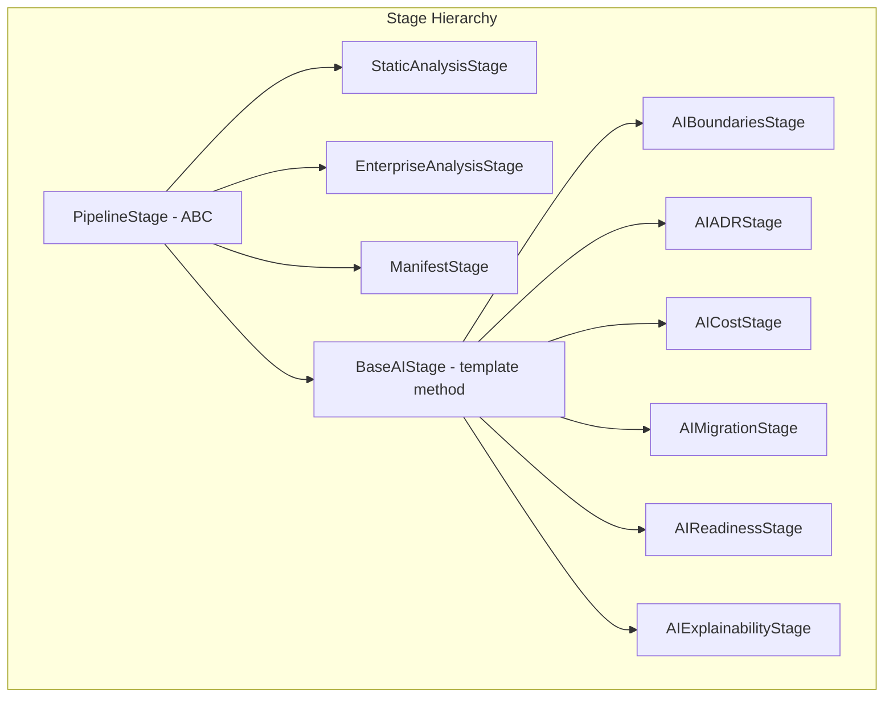
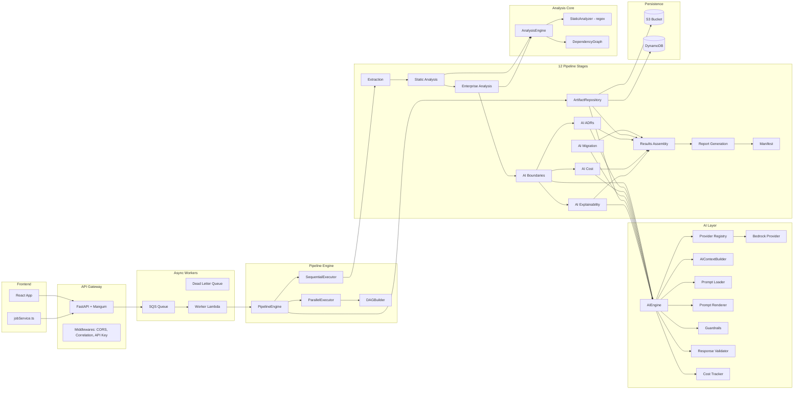

# EMIP AI Agent Guide

> **Read this first.** Every AI coding assistant modifying EMIP must read this document before making any changes. It describes the system architecture, critical files, safe extension patterns, and common pitfalls.

---

## How EMIP Works in 30 Seconds

```
Upload ZIP → 12-stage Pipeline → AI Analysis → Artifacts → Reports
```

1. User uploads a Java/Spring Boot project as a ZIP file
2. PipelineEngine orchestrates 12 stages in sequence (or parallel via DAG)
3. Static analysis extracts code structure (classes, dependencies, endpoints)
4. AI stages (via Amazon Bedrock) analyze service boundaries, ADRs, costs, migration plans, readiness, and explainability
5. Each stage produces a versioned Artifact stored in S3 via ArtifactRepository
6. A manifest aggregates all artifacts for the job
7. Reports are generated from assembled artifacts
8. Frontend displays results via the REST API

---

## Where AI Prompts Live

**Directory**: `backend/app/prompts/`

```
prompts/
├── adr.txt                     # ADR generation prompt
├── adr/                        # ADR prompt variants
├── analysis/                   # Analysis prompts
├── architecture.txt            # Architecture analysis prompt
├── architecture/               # Architecture prompt variants
├── developer/                  # Developer report prompts
├── executive/                  # Executive summary prompts
├── migration.txt               # Migration plan prompt
├── migration/                  # Migration prompt variants
├── optimization/               # Optimization prompts
├── readiness.txt               # Readiness assessment prompt
├── recommendations/            # Recommendation prompts
├── security/                   # Security analysis prompts
├── summary.txt                 # Summary prompt
├── system/                     # System prompts
└── templates/                  # Versioned template system
    ├── __init__.py
    ├── loader.py               # Template loading
    ├── renderer.py             # Template rendering with context
    └── versions.py             # Template version tracking
```

- **Templates** are versioned — `templates/versions.py` tracks active template versions.
- **Loading** uses `PromptLoader` in `templates/loader.py`.
- **Rendering** uses `PromptRenderer` in `templates/renderer.py` which injects context variables.
- AI prompt templates are rendered with context from `AIContextBuilder` in `backend/app/ai/context/builder.py`.

---

## Where Artifacts Are Generated

**Directory**: `backend/app/artifacts/`

```
artifacts/
├── __init__.py
├── models.py         # Artifact, ArtifactMetadata, ArtifactManifest dataclasses
├── repository.py     # ArtifactRepository — save/load/list in S3
└── version.py        # ArtifactVersioner — IDs, checksums, versions
```

Every stage produces an `Artifact` with:
- `metadata` (ArtifactMetadata): id, type, version, job_id, timestamps, generator, model, checksum, size, degraded flag, parent artifact IDs
- `content` (dict): the stage-specific output data

**Schema version**: Currently `"1.0.0"` — defined as `ARTIFACT_SCHEMA_VERSION` in `models.py`.

**Persistence**: `ArtifactRepository` handles all S3 interactions with transparent gzip compression for artifacts >10 KB.

---

## How the Pipeline Works

### Architecture

```
PipelineEngine
├── SequentialExecutor (default) — runs stages one by one
└── ParallelExecutor (optional) — runs stages via DAG scheduling
```

### Stage Types



### All 12 Stages (in order)

| # | Stage | Class | AI? | Phase | Output |
|---|-------|-------|-----|-------|--------|
| 1 | Extraction | `ExtractionStage` | No | `extraction` | Extracted ZIP contents |
| 2 | Static Analysis | `StaticAnalysisStage` | No | `static_analysis` | Classes, deps, endpoints |
| 3 | Enterprise Analysis | `EnterpriseAnalysisStage` | No | `analysis` | Business capabilities, rules |
| 4 | AI Boundaries | `AIBoundariesStage` | Yes | `ai_boundaries` | Service boundary candidates |
| 5 | AI ADRs | `AIADRStage` | Yes | `ai_adr` | Architecture Decision Records |
| 6 | AI Cost | `AICostStage` | Yes | `ai_cost` | Cost estimates |
| 7 | AI Migration | `AIMigrationStage` | Yes | `ai_migration` | Migration plan |
| 8 | AI Readiness | `AIReadinessStage` | Yes | `ai_readiness` | Readiness assessment |
| 9 | AI Explainability | `AIExplainabilityStage` | Yes | `ai_explainability` | Explainability data |
| 10 | Results Assembly | `ResultsAssemblyStage` | No | `results` | Aggregated results |
| 11 | Report Generation | `ReportGenerationStage` | No | `reports` | Generated reports |
| 12 | Manifest | `ManifestStage` | No | `manifest` | Complete manifest |

### Execution Flow

1. `PipelineEngine.execute()` initializes context from `initial_data`
2. Chooses `SequentialExecutor` or `ParallelExecutor` based on `parallel` flag
3. For each stage (sequentially):
   - Call `stage.validate_prerequisites(context)` — if unmet, fail
   - Call `stage.should_skip(context)` — if true, skip
   - Call `stage.execute(context)` — returns `Artifact`
   - Save artifact via `repo.save(job_id, stage.name, artifact)`
   - Update context with artifact content
4. Return `PipelineState` with per-stage status, timing, and artifact references

### BaseAIStage Template Method

```python
class BaseAIStage(PipelineStage):
    def execute(self, context: PipelineContext) -> Artifact:
        try:
            result, model_id = self.execute_ai(context)     # Subclass implements
            if not result:
                result = self.fallback()                     # Fallback on empty
                is_degraded = True
        except Exception:
            result = self.fallback()                         # Fallback on error
            is_degraded = True

        return Artifact(metadata=..., content=result)       # Always returns Artifact
```

---

## Where Reports Are Created

**File**: `backend/app/reports/builders.py` — function `build_all_reports()`

Reports are generated in the `report_generation` stage. They are stored as artifacts with type `report_*`. The manifest aggregates all report artifact references.

---

## AWS Integration

**Factory**: `backend/app/aws/clients.py` — `AWSClients` class

```python
from app.core.dependencies import get_aws_clients

clients = get_aws_clients()
clients.s3         # S3 client
clients.dynamodb   # DynamoDB resource
clients.bedrock    # Bedrock runtime client
clients.sqs        # SQS client
clients.sns        # SNS client
clients.cloudwatch # CloudWatch client
clients.events     # EventBridge client
clients.sts        # STS client
```

**NEVER create boto3 clients directly.** Always use the factory.

---

## Key Files Map

### Pipeline & Core

| File | Purpose |
|------|---------|
| `backend/app/pipeline/engine.py` | PipelineEngine — orchestrates all stages |
| `backend/app/pipeline/stage.py` | PipelineStage — abstract base class |
| `backend/app/pipeline/stages/base.py` | BaseAIStage — template method for AI stages |
| `backend/app/pipeline/context.py` | PipelineContext — shared context across stages |
| `backend/app/pipeline/state.py` | PipelineState — tracks execution state |
| `backend/app/pipeline/stages/__init__.py` | Stage registry — all 12 stages |

### AI Layer

| File | Purpose |
|------|---------|
| `backend/app/ai/engine.py` | AIEngine — central AI orchestration |
| `backend/app/ai/service.py` | AIService — high-level AI interface |
| `backend/app/ai/provider/` | Provider adapters (Nova; capability metadata for Claude/Mistral/Llama) |
| `backend/app/ai/provider/nova.py` | Amazon Nova model adapter |
| `backend/app/ai/context/builder.py` | AIContextBuilder — builds AI-ready context |
| `backend/app/ai/capability_registry.py` | CapabilityRegistry — maps capabilities to AI functions |
| `backend/app/ai/orchestrator.py` | AI orchestrator with fallback routing |
| `backend/app/ai/cost/tracker.py` | AICostTracker — tracks token usage and costs |
| `backend/app/ai/validation/validator.py` | AIResponseValidator — validates model responses |
| `backend/app/ai/guardrails/validator.py` | PromptValidator — validates prompts before sending |

### Analysis Engine

| File | Purpose |
|------|---------|
| `backend/app/analysis/engine.py` | AnalysisEngine — Sprint 2 plugin-based analysis |
| `backend/app/services/static_analyzer.py` | StaticAnalyzer — regex-based Java analysis |
| `backend/app/services/orchestrator.py` | OrchestratorService — full analysis coordination (legacy) |

### Artifacts

| File | Purpose |
|------|---------|
| `backend/app/artifacts/models.py` | Artifact, ArtifactMetadata, ArtifactManifest |
| `backend/app/artifacts/repository.py` | ArtifactRepository — S3 persistence |
| `backend/app/artifacts/version.py` | ArtifactVersioner — ID generation, checksums |

### Routes & API

| File | Purpose |
|------|---------|
| `backend/app/routes/upload.py` | POST /api/upload — file upload |
| `backend/app/routes/analyze.py` | POST /api/analyze — start analysis |
| `backend/app/routes/jobs.py` | GET /api/jobs — job status and listing |
| `backend/app/routes/results.py` | GET /api/results — artifact retrieval |
| `backend/app/routes/deploy.py` | POST /api/deploy — deployment actions |

### Configuration & Monitoring

| File | Purpose |
|------|---------|
| `backend/app/core/settings.py` | Settings — pydantic-settings, all env vars |
| `backend/app/core/analysis_profile.py` | AnalysisProfile — per-mode limits (FAST, NORMAL, DEEP, BENCHMARK) |
| `backend/app/core/security.py` | APIKeyMiddleware — API key auth |
| `backend/app/core/dependencies.py` | Dependency injection helpers |
| `backend/app/monitoring/logging.py` | Structlog configuration |
| `backend/app/monitoring/middleware.py` | CorrelationMiddleware — request ID tracing |
| `backend/app/exceptions/custom.py` | EMIPException hierarchy |

### Infrastructure

| File | Purpose |
|------|---------|
| `infrastructure/template.yaml` | SAM template — canonical IaC |
| `infrastructure/app.py` | CDK app — experimental/legacy, do not deploy |
| `infrastructure/cdk_stacks/` | CDK stack definitions |
| `handler.py` | Lambda handler (FastAPI + Mangum) |
| `worker_handler.py` | Worker Lambda handler |
| `backend/Dockerfile` | Container image build |

### Frontend

| File | Purpose |
|------|---------|
| `frontend/src/pages/` | 9 page components |
| `frontend/src/services/jobService.ts` | API client |

### Tests

| File | Purpose |
|------|---------|
| `backend/tests/test_sprint3_ai_layer.py` | AI engine/service/provider tests |
| `backend/tests/test_sprint5_6_benchmark.py` | BENCHMARK profile tests |
| `backend/tests/test_sprint5_integration.py` | End-to-end pipeline tests |
| `backend/tests/test_sprint5_dag.py` | DAG scheduling tests |
| `backend/tests/test_truncation_integration.py` | Truncation logic tests |

---

## Dependency Chain

```
ExtractionStage
└── StaticAnalysisStage
    └── EnterpriseAnalysisStage
        ├── AIBoundariesStage
        │   ├── AIADRStage
        │   ├── AICostStage
        │   └── AIExplainabilityStage
        ├── AIMigrationStage
        └── AIReadinessStage
            └── ResultsAssemblyStage
                └── ReportGenerationStage
                    └── ManifestStage
```

Stages with no explicit `depends_on` use `validate_prerequisites()` to infer dependencies at runtime. When `parallel=True`, the `DAGBuilder` in `backend/app/scheduling/dag.py` resolves the dependency graph.

---

## What NEVER to Modify

| Component | Reason |
|-----------|--------|
| **Artifact schemas** (`models.py`) | Without incrementing `ARTIFACT_SCHEMA_VERSION` and maintaining backward compatibility. Breaking artifact schemas breaks all stored data. |
| **API contracts** (`routes/`, `models/schemas.py`) | Without versioning. Frontend and third-party consumers depend on stable contracts. |
| **Manifest schema** (`ArtifactManifest` in `models.py`) | The manifest is the public contract for analysis results. |
| **BaseAIStage template method** (`stages/base.py`) | The `execute()` → `execute_ai()` → `fallback()` pattern is fundamental. Bypassing it breaks error handling, degraded mode detection, and artifact metadata consistency. |
| **PipelineEngine.execute()** (`engine.py`) | Core orchestration logic. Modifying the execution loop risks breaking checkpointing, progress reporting, and parallel execution. |
| **ArtifactRepository internals** (`repository.py`) | All persistence logic. Breaking the repository corrupts artifact storage. Extend via new methods, don't modify existing ones. |
| **AWSClients factory** (`aws/clients.py`) | All AWS access depends on this. Modifying initialization or caching behavior can cause connection leaks or credential errors. |
| **AnalysisProfile fields** (`core/analysis_profile.py`) | Adding or removing fields requires updating all profile definitions (FAST, NORMAL, DEEP, BENCHMARK) and all consumers. |

---

## How to Safely Extend the Project

### Adding a New Pipeline Stage

1. **Create the stage class** in `backend/app/pipeline/stages/`:
   - Extend `PipelineStage` for non-AI stages
   - Extend `BaseAIStage` for AI-powered stages
   - Override `name`, `phase`, `execute_ai()` / `execute()`, `fallback()`

2. **Register the stage** in `backend/app/pipeline/stages/__init__.py`:
   - Add the import and add to `__all__`

3. **Add artifact schema** if the stage produces a new artifact type:
   - Define content structure in documentation
   - Use existing `Artifact` class — no schema changes needed unless adding new metadata fields

4. **Add fallback handling** if the stage requires AI:
   - Implement `fallback()` returning a sensible default
   - Ensure downstream stages handle degraded input

5. **Update manifest stage** if the stage produces artifacts that should appear in the manifest

6. **Add tests** in `backend/tests/`:
   - Test happy path, error handling, and fallback

### Adding a New AI Model

1. Add model capabilities to `_MODEL_CAPABILITIES` in `backend/app/core/analysis_profile.py`
2. The model will be auto-detected by `detect_model_capabilities()` via prefix matching
3. BENCHMARK profile will automatically use the correct limits

### Adding a New Prompt Template

1. Add the template file to `backend/app/prompts/templates/`
2. Register it in `templates/versions.py`
3. Use `PromptRenderer` to render with context variables

---

## File Change Protocol

Always follow this order when modifying EMIP:

```
1. Read the spec file (docs/specs/<spec>.md)
2. Read relevant source files
3. Read CLAUDE.md for project rules
4. Implement changes following docs/12_CODING_GUIDELINES.md
5. Update progress files in docs/progress/
6. Verify with tests: cd backend && python -m pytest tests/ -v
7. Mark completion in docs/progress/completed.md
```

---

## Common Pitfalls

| Pitfall | Why It Happens | How to Avoid |
|---------|---------------|--------------|
| Creating boto3 clients directly | Fastest path to AWS access | Always use `get_aws_clients()` from `app.core.dependencies` |
| Bypassing BaseAIStage | Simpler to write `execute()` directly | Always extend `BaseAIStage` — the template method handles fallback, artifact creation, and degraded flagging |
| Hardcoding limits | Easy to use a number literal | Always use `AnalysisProfile` fields |
| Modifying artifact schemas without versioning | Schema needs a new field | Increment version, maintain backward compat, update all consumers |
| Missing fallback in AI stages | AI stage seems simple | Every AI path must have a `fallback()` — Bedrock can fail at any time |
| Exposing raw exceptions in API | Unhandled exception in route | Raise `EMIPException` subclasses — handlers convert to JSON |
| Using `print()` or `logging` | Familiar from other projects | Always use `structlog.get_logger(__name__)` |
| Adding TODOs without issues | During development | Track in issue tracker, not in code |
| Forgetting to register new stages | New file added but `__init__.py` not updated | Always update `pipeline/stages/__init__.py` |
| Not testing fallback paths | Happy path works in development | Mock Bedrock to fail and verify fallback produces valid degraded artifacts |
| Importing relative paths | Refactoring modules | Always use absolute imports from `app.*` |

---

## System Architecture Diagram



---

## Final Reminders

- **Read the spec first** — every task has a spec in `docs/specs/`
- **Follow the guidelines** — `docs/12_CODING_GUIDELINES.md` has comprehensive rules
- **Never skip fallbacks** — every AI path must degrade gracefully
- **Version everything** — artifacts, schemas, API contracts
- **Test after every change** — `cd backend && python -m pytest tests/ -v`
- **Update progress** — mark tasks in `docs/progress/in-progress.md` and `docs/progress/completed.md`
- **Ask if unsure** — modifying core components without understanding the full impact can break the system
