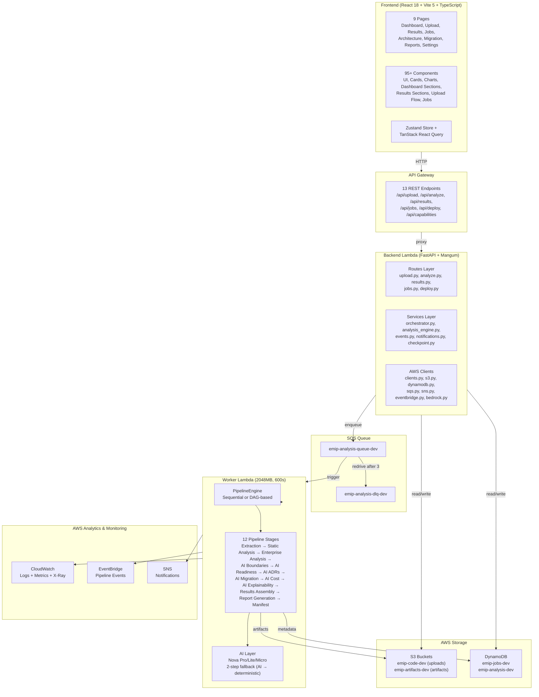
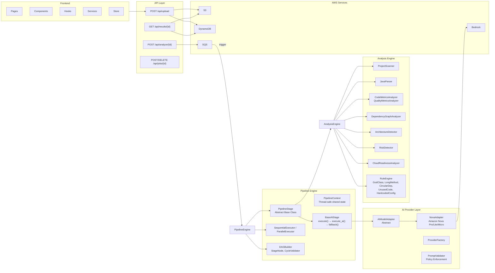

# Architecture Design — EMIP

## High-Level System Architecture

## Component Diagram

## Key Design Patterns

1. **Artifact-First Pipeline**: Every stage produces a versioned Artifact. Stages communicate through artifacts only, not shared memory.

2. **Plugin-Based Analysis**: The Sprint 2 analysis engine uses a plugin architecture where Analyzers are registered by phase and executed in order.

3. **Degraded Mode**: If an AI stage fails, the pipeline continues. The final manifest reports which stages were degraded. No hard failures.

4. **Checkpoint/Resume**: Pipeline state is checkpointed after each stage. Jobs can be paused, cancelled, and resumed from the last checkpoint.

5. **Dual AI Path**: The orchestrator can use either the Sprint 3 AI intelligence layer or fall back to direct Bedrock calls.

6. **DAG-Based Parallel Execution**: Stages with explicit dependencies can run in parallel when the DAG executor is enabled.

7. **2-Step Fallback Chain** (in `BaseAIStage`): AI succeeds → result used; AI fails or returns empty → single deterministic fallback with `is_degraded=true`; pipeline continues and the manifest reports degraded stages.

## Data Flow

1. **Upload**: User uploads ZIP → POST /api/upload → S3 jobs/{id}/raw/ → DynamoDB job record → Response: job_id
2. **Trigger**: POST /api/analyze/{id} → Backend enqueues to SQS → Response: 202 Accepted
3. **Worker**: SQS triggers Worker Lambda → Builds pipeline context → Executes 12 stages (sequential or DAG)
4. **Artifacts**: Each stage writes an Artifact via ArtifactRepository → S3 + DynamoDB metadata
5. **Polling**: Frontend polls GET /api/results/{id} → Displays real-time progress
6. **Completion**: Pipeline completes → EventBridge event → SNS terminal notification (email when `NotificationEmail` is set); the frontend picks up finished results by polling
