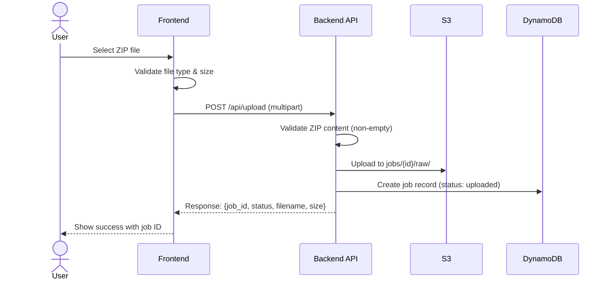
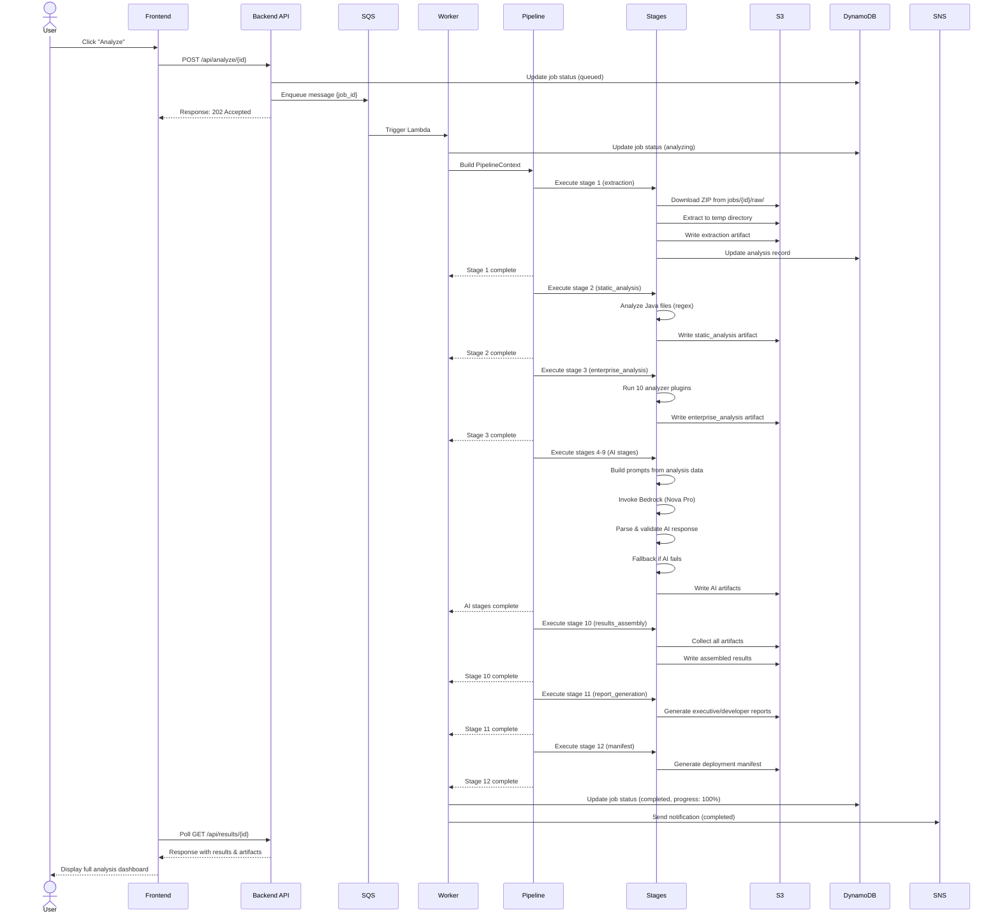
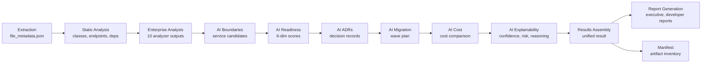
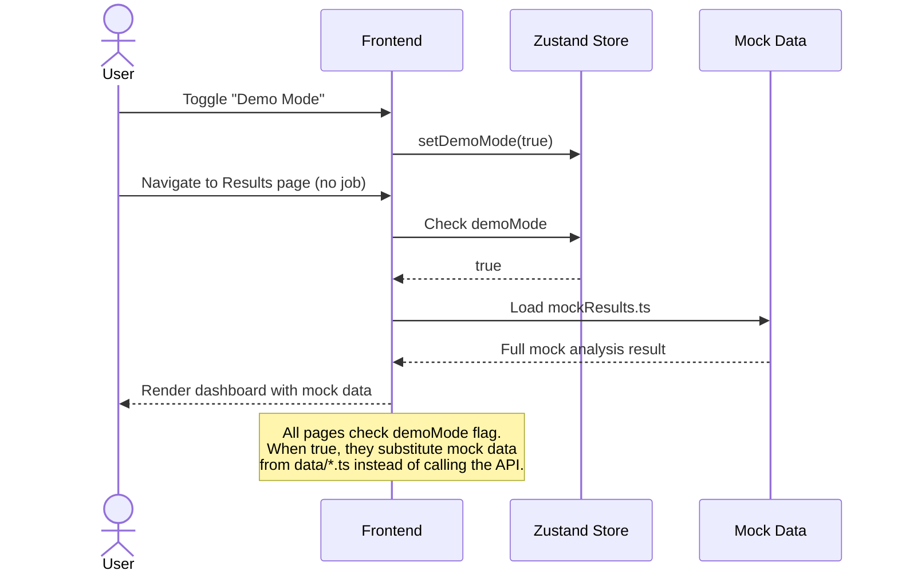

# Workflow Design — EMIP

## Upload Workflow

## Analysis Pipeline Workflow

## Artifact Flow Between Stages

## Demo Mode Workflow

## How Results Reach the Frontend

1. Frontend calls GET /api/jobs to list jobs
2. User clicks a job → navigates to /jobs/{jobId}/results
3. Frontend calls GET /api/results/{jobId} to get status & results
4. useJobPolling hook polls every 1.5s while status is "analyzing"
5. On completion, fetches all artifact details
6. Renders data through page components → section components → card/chart components
7. Each section component receives typed props from types/results.ts computed helpers
